# Chapter 12: MCP Integration and External Protocols

> "Protocols are the language systems use to communicate; good protocols turn integration into composition rather than coding."
> -- Adapted from *Designing Distributed Systems*

**Learning Objectives:** After reading this chapter, you will be able to:

- Understand the technical background behind MCP (Model Context Protocol), its design philosophy, and the core problems it solves
- Master the use cases, performance characteristics, and selection strategies for 8 transport protocols
- Analyze in depth the design logic behind 7 configuration scopes and the three-layer security strategy
- Understand the Bridge system's bidirectional communication architecture, SSE sequence number continuation, and multi-session security design
- Master the complete pipeline of MCP tool discovery, mapping, naming, and permission models
- Design enterprise-grade MCP security strategies, configure allowlists/denylists, and IDE integration
- Understand how MCP integration collaborates with the tool system (Chapter 3), hook system (Chapter 8)

---

## 12.1 MCP Architecture Overview

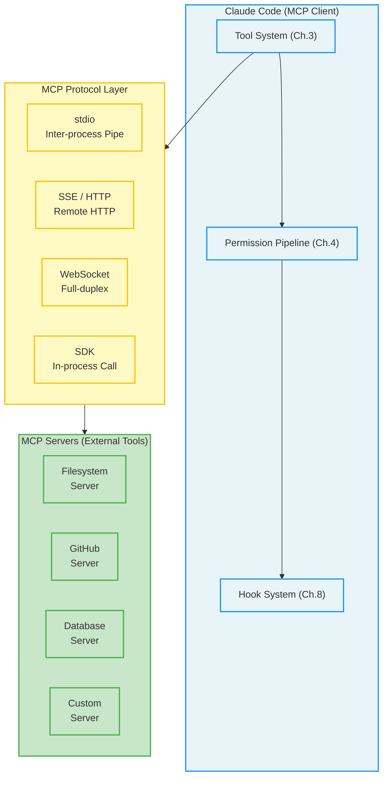
```mermaid
flowchart TD
    subgraph ClaudeCode["Claude Code (MCP Client)"]
        direction TB
        ToolSys["Tool System (Ch.3)"]
        PermPipe["Permission Pipeline (Ch.4)"]
        HookSys["Hook System (Ch.8)"]
        ToolSys --> PermPipe
        PermPipe --> HookSys
    end

    subgraph Protocol["MCP Protocol Layer"]
        direction LR
        Stdio["stdio\nInter-process Pipe"]
        SSE["SSE / HTTP\nRemote HTTP"]
        WS["WebSocket\nFull-duplex"]
        SDK["SDK\nIn-process Call"]
    end

    subgraph Servers["MCP Servers (External Tools)"]
        direction LR
        S1["Filesystem\nServer"]
        S2["GitHub\nServer"]
        S3["Database\nServer"]
        S4["Custom\nServer"]
    end

    ToolSys --> Protocol
    Protocol --> Servers

    classDef client fill:#e8f4f8,stroke:#2196F3,stroke-width:2px,color:#333
    classDef proto fill:#fff9c4,stroke:#FFC107,stroke-width:2px,color:#333
    classDef server fill:#c8e6c9,stroke:#4CAF50,stroke-width:2px,color:#333
    class ClaudeCode,ToolSys,PermPipe,HookSys client
    class Protocol,Stdio,SSE,WS,SDK proto
    class Servers,S1,S2,S3,S4 server
```

### 12.1.1 Why MCP: Problems and Solutions

Before diving into technical details, let's first understand the fundamental problem MCP aims to solve.

**The Fragmented Integration Dilemma**

In the LLM application ecosystem, a core challenge has long persisted: every AI application needs to connect to external data sources and tools, but each application's integration approach is different. Imagine you're a database vendor who wants to make your data accessible to various AI tools. Without a unified standard, you'd need to develop a separate adapter for each AI platform — one for Claude, one for ChatGPT, one for Cursor... This is like the era before USB standards, when every phone had its own unique charging port.

MCP emerged to become the "USB-C port" of the AI world. It defines an open standard protocol that allows any AI application to connect to any data source or tool in a unified way. For tool developers, implementing an MCP server once makes it usable by all MCP-compatible AI applications; for AI application developers, implementing an MCP client once grants access to the entire MCP ecosystem.

**Three Core Design Principles**

MCP's design follows three core principles that permeate Claude Code's entire MCP implementation:

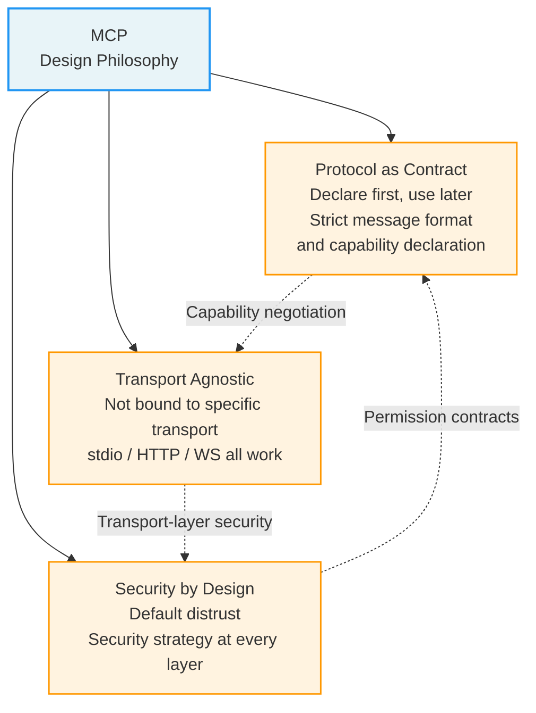
```mermaid
flowchart TD
    Center["MCP\nDesign Philosophy"]

    Center --> P1["Protocol as Contract\nDeclare first, use later\nStrict message format\nand capability declaration"]
    Center --> P2["Transport Agnostic\nNot bound to specific transport\nstdio / HTTP / WS all work"]
    Center --> P3["Security by Design\nDefault distrust\nSecurity strategy at every layer"]

    P1 -.->|"Capability negotiation"| P2
    P2 -.->|"Transport-layer security"| P3
    P3 -.->|"Permission contracts"| P1

    classDef center fill:#e8f4f8,stroke:#2196F3,stroke-width:2px,color:#333
    classDef principle fill:#fff3e0,stroke:#FF9800,stroke-width:1.5px,color:#333
    class Center center
    class P1,P2,P3 principle
```

1. **Protocol as Contract**: MCP defines strict message formats and capability declaration mechanisms between client and server. Servers declare what tools, resources, and prompt templates they provide; clients retrieve this information through standardized requests. This "declare first, use later" pattern allows both parties to collaborate without understanding each other's internal implementation. This is consistent with the "interface as architecture" philosophy from the tool system in Chapter 3.

2. **Transport Agnostic**: The MCP protocol itself is not bound to any specific network transport method. The same MCP server can provide services through stdio, HTTP, WebSocket, and other methods. This design enables MCP servers to run in local processes (high performance, low latency) or be deployed on remote servers (centralized management, multi-user sharing) without modifying business logic.

3. **Security by Design**: MCP integrates security strategies into every layer of the protocol — from capability negotiation during connection establishment, to permission checks during tool invocation, to enterprise-level approval controls. This "default distrust" design ensures that even when untrusted third-party tools are connected, they cannot compromise the overall system's security.

> **Analogy:** Think of MCP as the USB protocol stack. The physical layer (USB-C cable) corresponds to MCP's transport layer (stdio/SSE/WS); the protocol layer (USB descriptors and endpoints) corresponds to MCP's capability declarations and tool discovery; the application layer (USB device drivers) corresponds to specific MCP tool implementations. Just as you don't need to know how a mouse works internally to use it, Claude Code doesn't need to know how an MCP server works internally to invoke its tools.

> **Cross-reference:** Once MCP tools are mapped to internal Claude Code Tool objects, they fully integrate into the tool system described in Chapter 3. This means MCP tools go through the same four-stage permission pipeline checks (Chapter 4), participate in the same concurrency scheduling strategies, and can be intercepted and enhanced through the hook system (Chapter 8).

### 12.1.2 Supported Transport Protocols

Claude Code supports 8 MCP transport protocols, each optimized for different deployment scenarios and network topologies. Understanding the appropriate use cases for these protocols is the foundation for designing efficient MCP integration architectures.

| Protocol Type | Config Type | Transport Method | Latency Profile | Use Case |
|---------|---------|---------|---------|---------|
| `stdio` | `McpStdioServerConfig` | Standard I/O pipes | Lowest (inter-process) | Local dev tools, filesystem operations, CLI tool wrappers |
| `sse` | `McpSSEServerConfig` | Server-Sent Events | Network latency | Remote HTTP services, cloud-deployed MCP servers |
| `sse-ide` | `McpSSEIDEServerConfig` | SSE + IDE metadata | Local network | IDE extension only, includes `ideName` identifier |
| `http` | `McpHTTPServerConfig` | HTTP Streamable | Network latency | New MCP spec protocol, supports streaming responses |
| `ws` | `McpWebSocketServerConfig` | WebSocket full-duplex | Network latency | Scenarios requiring real-time bidirectional communication |
| `ws-ide` | `McpWebSocketIDEServerConfig` | WebSocket + IDE metadata | Local network | IDE extension only, requires low-latency bidirectional communication |
| `sdk` | `McpSdkServerConfig` | In-process function calls | Near-zero latency | SDK internal calls, no actual process or network connection started |
| `claudeai-proxy` | `McpClaudeAIProxyServerConfig` | Claude.ai proxy | Network latency | Claude.ai platform proxy servers |

**Transport Protocol Selection Decision Tree**

When you need to choose a transport protocol for an MCP server, refer to the following decision path:

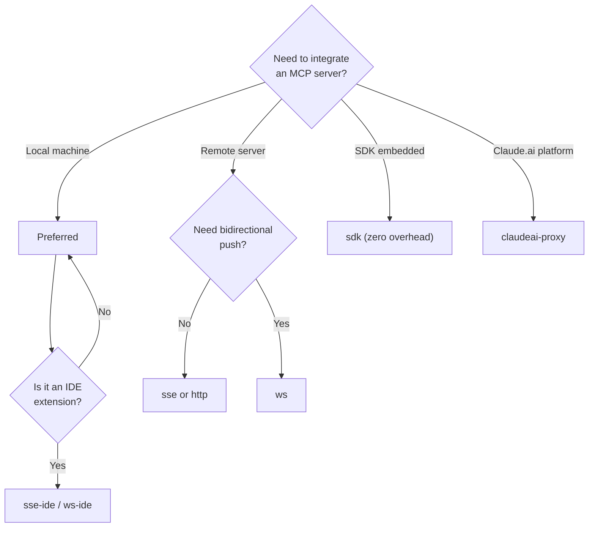
```mermaid
flowchart TD
    START{"Need to integrate\nan MCP server?"}
    START -->|"Local machine"| STDIO["Preferred"]
    STDIO --> IDE{"Is it an IDE\nextension?"}
    IDE -->|"Yes"| SSE_IDE["sse-ide / ws-ide"]
    IDE -->|"No"| STDIO
    START -->|"Remote server"| REMOTE{"Need bidirectional\npush?"}
    REMOTE -->|"No"| SSE_HTTP["sse or http"]
    REMOTE -->|"Yes"| WS["ws"]
    START -->|"SDK embedded"| SDK["sdk (zero overhead)"]
    START -->|"Claude.ai platform"| PROXY["claudeai-proxy"]
```

**Protocol Details and Use Case Analysis**

**The stdio protocol** is the most common and recommended type. It launches a local MCP server subprocess via `command` and `args`, communicating through the operating system's standard I/O pipes. The advantages of this approach are: zero network overhead (data passes between processes via memory buffers), natural security isolation (child processes inherit the parent process's permission boundaries), and simple lifecycle management (child processes automatically terminate when the parent exits). The vast majority of local development scenarios — filesystem access, Git operations, database clients — should prefer stdio.

```json
{
  "mcpServers": {
    "filesystem": {
      "type": "stdio",
      "command": "npx",
      "args": ["-y", "@modelcontextprotocol/server-filesystem", "/home/user/projects"],
      "env": { "NODE_OPTIONS": "--max-old-space-size=4096" }
    }
  }
}
```

**The SSE protocol** is suited for remotely deployed MCP servers. Server-Sent Events is an HTTP-based unidirectional push technology: the client sends requests via HTTP POST, and the server streams responses and notifications via SSE. The advantage is deployment flexibility — the MCP server can run anywhere in the cloud, and Claude Code only needs to know the URL to connect. However, this introduces additional network latency and authentication complexity.

**The sse-ide and ws-ide protocols** are specialized types for IDE integration, adding IDE identification information (such as the `ideName` field, identifying whether it's VS Code or JetBrains) on top of standard SSE/WebSocket protocols. This "protocol variant" design pattern avoids embedding platform-specific logic into the generic protocol, keeping the core protocol clean.

**The HTTP Streamable protocol** is a newer protocol in the MCP specification that provides more flexible streaming response capabilities compared to SSE. It supports incrementally returning response content over a single HTTP connection, making it suitable for tools that need to return large amounts of data or run for extended periods.

**The WebSocket protocol** provides full-duplex communication capabilities, suited for scenarios requiring real-time bidirectional data exchange. Unlike SSE's unidirectional push, WebSocket allows the server to proactively send messages to the client and allows the client to send requests at any time without establishing new HTTP connections.

**The SDK protocol** is the most special type — it doesn't start any process or open any network connection. SDK-type MCP servers are embedded directly into the Claude Code process through function calls, with near-zero latency. It's primarily used for SDK integration scenarios, allowing third-party applications embedding Claude Code to register MCP tools directly without additional inter-process communication. For this reason, SDK servers are exempt from enterprise security policy checks — they run in the same process as Claude Code, with security boundaries guaranteed by the host application.

> **Best Practice:** Prefer the stdio protocol. Only consider SSE/HTTP/WebSocket when the MCP server must run on a remote machine (e.g., accessing an internal company database, using centralized compute resources). The SDK protocol is only for programmatic integration scenarios.

> **Anti-pattern Warning:** Do not perform long-running initialization operations in stdio servers. Claude Code connects to all configured MCP servers in parallel at startup; if one server's initialization takes too long (e.g., establishing a database connection pool, loading a large model), it will slow down the entire startup process. Consider lazy initialization strategies — establish connections only on the first tool invocation.

### 12.1.3 Connection Manager: MCPConnectionManager

The MCP connection manager is a React Context Provider that provides MCP connection management capabilities to the entire component tree. Its design embodies the "centralized control, distributed usage" architecture pattern — connection establishment, disconnection, and retries are handled uniformly by the manager, while tool usage is distributed across individual components.

**Why the Context Provider Pattern?**

Claude Code's UI layer is built on React. In the React component tree, if each component independently managed MCP connections, it would cause two serious problems: wasted connection resources (the same MCP server might be repeatedly connected by multiple components) and inconsistent state (one component has already detected a server disconnect while another is still using a cached tool list). The Context Provider pattern ensures all child components see consistent MCP state by injecting a shared connection management service at the top of the component tree.

Its core interface provides two operations:

- **Reconnect**: Triggers the reconnection flow for a specified MCP server, returning the updated tool list, command list, and resource list. This is used when server configuration changes or after recovering from a network interruption.
- **Toggle**: Controls the enabled/disabled state of a specified MCP server. Disabling a server disconnects it and removes all its tools; enabling a server re-establishes the connection and registers tools.

Child components access these operations through two hooks: one for the reconnect function (`useMcpReconnect`) and one for the toggle function (`useMcpToggle`). Both require usage within the `MCPConnectionManager` component tree, or they will throw an error. This is the standard React Context safety pattern — ensuring the Context is only consumed within legitimate component hierarchies.

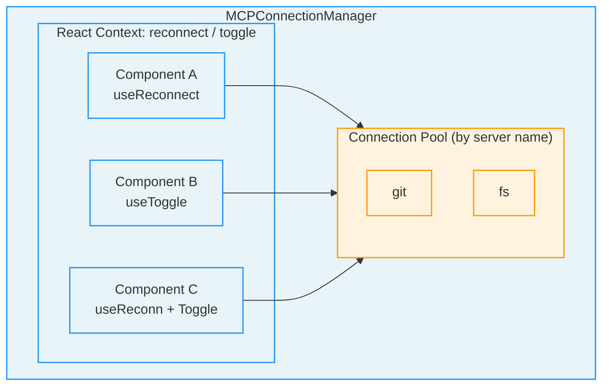
```mermaid
flowchart TD
    subgraph Mgr["MCPConnectionManager"]
        subgraph CTX["React Context: reconnect / toggle"]
            A["Component A\nuseReconnect"]
            B["Component B\nuseToggle"]
            C["Component C\nuseReconn + Toggle"]
        end
        A --> Pool
        B --> Pool
        C --> Pool
        subgraph Pool["Connection Pool (by server name)"]
            G["git"]
            F["fs"]
        end
    end

    classDef box fill:#e8f4f8,stroke:#2196F3,stroke-width:1.5px,color:#333
    classDef pool fill:#fff3e0,stroke:#FF9800,stroke-width:1.5px,color:#333
    class A,B,C box
    class Pool,G,F pool
    class Mgr,CTX box
```

### 12.1.4 Server Connection States and Lifecycle

MCP server connections have five states, forming a carefully designed finite state machine: Connected, Failed, NeedsAuth, Pending (with retry support), and Disabled.

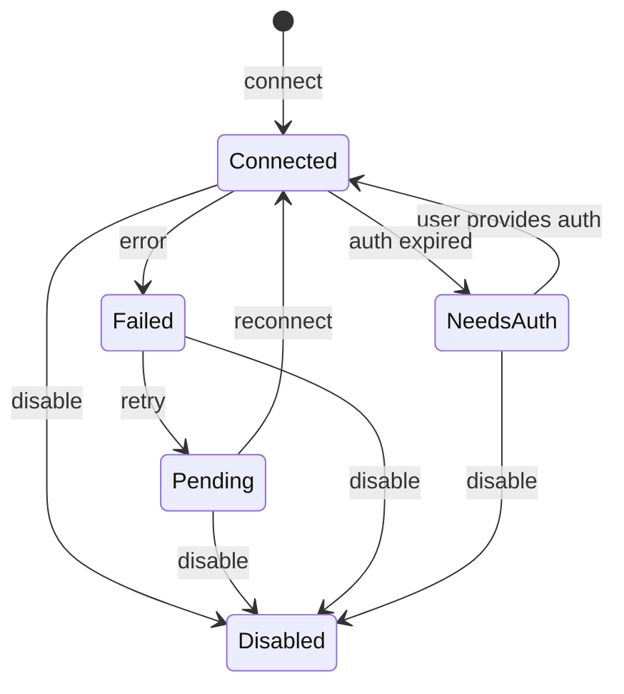
```mermaid
stateDiagram-v2
    [*] --> Connected : connect
    Connected --> Failed : error
    Connected --> Disabled : disable
    Failed --> Pending : retry
    Pending --> Connected : reconnect
    Pending --> Disabled : disable
    Failed --> Disabled : disable
    NeedsAuth --> Connected : user provides auth
    Connected --> NeedsAuth : auth expired
    NeedsAuth --> Disabled : disable
```

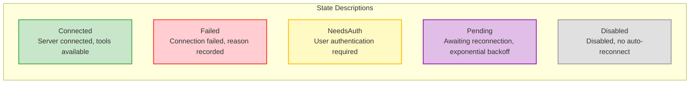
```mermaid
flowchart LR
    subgraph legend["State Descriptions"]
        C["Connected\nServer connected, tools available"]
        F["Failed\nConnection failed, reason recorded"]
        N["NeedsAuth\nUser authentication required"]
        P["Pending\nAwaiting reconnection, exponential backoff"]
        D["Disabled\nDisabled, no auto-reconnect"]
    end
    classDef conn fill:#c8e6c9,stroke:#4CAF50,stroke-width:2px,color:#333
    classDef fail fill:#ffcdd2,stroke:#f44336,stroke-width:2px,color:#333
    classDef auth fill:#fff9c4,stroke:#FFC107,stroke-width:2px,color:#333
    classDef pend fill:#e1bee7,stroke:#9C27B0,stroke-width:2px,color:#333
    classDef dis fill:#e0e0e0,stroke:#9E9E9E,stroke-width:2px,color:#333
    class C conn
    class F fail
    class N auth
    class P pend
    class D dis
```

**The Deeper Meaning of State Transitions**

Each state represents not only the technical state of the connection but also corresponds to different user interaction strategies:

- **Connected**: The server is connected and tools are available. `ConnectedMCPServer` contains the complete MCP Client instance, server capability declarations, configuration information, and a cleanup function (for graceful disconnection).
- **Failed**: The connection attempt failed. The system records the failure reason (network error, authentication failure, server not responding, etc.) and decides whether to enter the retry flow. Not all failures should be retried — authentication failures require user intervention, while network timeouts can be retried automatically.
- **NeedsAuth**: The server requires authentication but valid credentials were not provided. This is a critical aspect of security design — the system does not blindly retry connections that need authentication (which would lock accounts) but instead hands control to the user.
- **Pending**: Awaiting reconnection. `PendingMCPServer` records the number of reconnection attempts and the maximum retry count, supporting exponential backoff retry. This strategy avoids connection storms when the server is persistently unavailable.
- **Disabled**: A server that was actively disabled by the user or forcibly disabled by policy. It will not auto-reconnect; only explicit user re-enablement will trigger a connection attempt.

**Design Considerations for Exponential Backoff Retry**

The Pending state's retry uses an exponential backoff algorithm: the 1st retry waits approximately 1 second, the 2nd 2 seconds, the 3rd 4 seconds, and so on, until the maximum retry count is reached. This design is a standard fault-tolerance pattern in distributed systems. Its core logic is: if the server is temporarily unavailable, rapid consecutive retries only add burden; but if the server recovers in a few seconds, you don't want to wait too long.

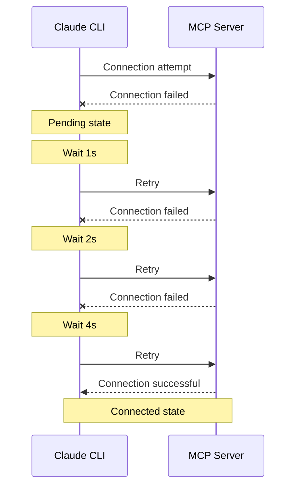
```mermaid
sequenceDiagram
    participant CLI as Claude CLI
    participant Server as MCP Server

    CLI->>Server: Connection attempt
    Server--xCLI: Connection failed

    Note over CLI: Pending state
    Note over CLI: Wait 1s
    CLI->>Server: Retry #1
    Server--xCLI: Connection failed

    Note over CLI: Wait 2s
    CLI->>Server: Retry #2
    Server--xCLI: Connection failed

    Note over CLI: Wait 4s
    CLI->>Server: Retry #3
    Server-->>CLI: Connection successful

    Note over CLI,Server: Connected state
```

> **Connection to Chapter 3:** MCP tools only appear in the tool list when the server is in the Connected state. When a server transitions from Connected to any other state, all its tools are immediately removed from the available tool list. This is tightly integrated with the tool registration mechanism described in Chapter 3 — tool availability is dynamic, not static.

---

## 12.2 MCP Tool Integration

MCP tool integration is the process of seamlessly incorporating external server capabilities into Claude Code's internal tool system. This process involves three key stages: Discovery, Mapping, and Registration. Understanding this pipeline is understanding how MCP transforms "external tools" into "internal capabilities."

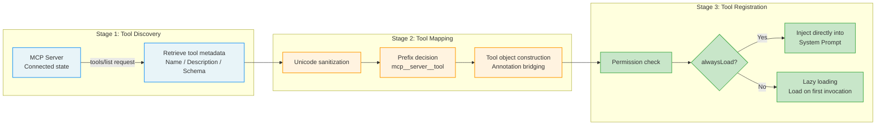
```mermaid
flowchart LR
    subgraph Discovery["Stage 1: Tool Discovery"]
        D1["MCP Server\nConnected state"] -->|"tools/list request"| D2["Retrieve tool metadata\nName / Description / Schema"]
    end

    subgraph Mapping["Stage 2: Tool Mapping"]
        M1["Unicode sanitization"] --> M2["Prefix decision\nmcp__server__tool"]
        M2 --> M3["Tool object construction\nAnnotation bridging"]
    end

    subgraph Registration["Stage 3: Tool Registration"]
        R1["Permission check"] --> R2{"alwaysLoad?"}
        R2 -->|"Yes"| R3["Inject directly into\nSystem Prompt"]
        R2 -->|"No"| R4["Lazy loading\nLoad on first invocation"]
    end

    D2 --> M1
    M3 --> R1

    classDef disc fill:#e8f4f8,stroke:#2196F3,stroke-width:1.5px,color:#333
    classDef map fill:#fff3e0,stroke:#FF9800,stroke-width:1.5px,color:#333
    classDef reg fill:#c8e6c9,stroke:#4CAF50,stroke-width:1.5px,color:#333
    class D1,D2 disc
    class M1,M2,M3 map
    class R1,R2,R3,R4 reg
```

### 12.2.1 Tool Discovery and Mapping

**Discovery Stage**

After an MCP server successfully connects (entering the Connected state), Claude Code retrieves the server's tool list through a `tools/list` request. This request is part of the MCP protocol standard; the server must return metadata for all tools it provides — including tool names, descriptions, input parameter schemas, and behavioral annotations (hints).

> **Analogy:** Tool discovery is like sitting down at a restaurant and having the waiter hand you a menu. The menu lists all available dishes (tool names), ingredient descriptions (input parameters), and flavor tags (behavioral annotations). You don't need to visit the kitchen to see how the chef cooks — the menu is enough for you to make a choice.

**Mapping Stage**

The core tool mapping logic includes several key steps:

1. **Unicode Sanitization**: The returned tool list undergoes Unicode sanitization, removing control characters and illegal characters. This step may seem simple, but it's a classic example of defensive programming — you should never trust any external input, including characters in tool names.

2. **Prefix Decision**: Based on configuration, the system decides whether to add a server name prefix to tool names. In most modes, the prefix is mandatory (ensuring tool names don't conflict across servers); but in SDK mode, when the environment variable `CLAUDE_AGENT_SDK_MCP_NO_PREFIX` is set, tools are registered with their original names, allowing MCP tools to override built-in tools by name.

3. **Tool Object Construction**: Each MCP tool is mapped to a Claude Code internal `Tool` object. This mapping isn't simple field copying but a complete "protocol adaptation" — MCP semantics are translated into Claude Code tool system semantics.

After each MCP tool is mapped to a Claude Code internal `Tool` object, it contains the following key properties:

| Property | Source | Purpose |
|------|------|------|
| `isMcp: true` | Fixed flag | Identifies this as an MCP tool, distinguishing it from built-in tools |
| `mcpInfo` | Server config | Contains `serverName` and `toolName` metadata for permission checks and UI display |
| `isConcurrencySafe()` | MCP annotation `readOnlyHint` | Maps to concurrency safety determination, affects scheduling strategy |
| `isDestructive()` | MCP annotation `destructiveHint` | Maps to destructiveness determination, affects permission prompt level |
| `isOpenWorld()` | MCP annotation `openWorldHint` | Maps to open-world determination, affects permission scope checks |
| `alwaysLoad` | `_meta.anthropic/alwaysLoad` | When true, skips lazy loading and injects directly into system prompt |

**Behavioral Annotation Bridging Design**

The three "Hint" mappings in the table above deserve special attention. The MCP protocol defines tool behavioral annotations (such as `readOnlyHint`, `destructiveHint`), while Claude Code's tool system has its own semantic model (such as `isConcurrencySafe()`, `isDestructive()`). The mapping between these two semantic systems is not 1:1 — MCP's annotations are "suggestive" (hint), while Claude Code's methods are "decisive" (decision).

The elegance of this bridging design is that it allows MCP servers to describe their tool behavior in standardized language, while Claude Code can make final decisions based on its own security policies. If an MCP server's annotations are inaccurate (for example, a tool marked `readOnlyHint` that actually modifies data), Claude Code's permission pipeline will still perform a secondary check at runtime.

> **Cross-reference:** The concurrency safety (`isConcurrencySafe()`) here directly affects the concurrency partitioning strategy described in Chapter 3. MCP tools marked as concurrency-safe can execute in parallel with other safe tools, while unsafe tools must wait serially.

**Lazy Loading Mechanism**

The `alwaysLoad` property controls when tools are loaded. In the default lazy loading mode, MCP tool descriptions don't immediately appear in the system prompt (which would consume significant tokens); instead, they're loaded when the model first needs to use the tool. However, for tools marked with `alwaysLoad: true` (typically high-frequency foundational tools), the system injects them directly into the system prompt at startup, ensuring the model always knows these tools exist.

### 12.2.2 Tool Name Prefix: mcp__server__tool

MCP tools adopt a unified three-part naming convention `mcp__{server}__{tool}`. Behind this seemingly simple naming rule are several layers of important design considerations.

**Why Prefixes?**

Imagine a scenario: you're simultaneously connected to two MCP servers — one for GitHub tools and one for GitLab tools, and both provide a tool named `create_issue`. Without namespace isolation, the two tools would create a name conflict, and the model couldn't distinguish them. The three-part naming ensures global name uniqueness by using the server name as a namespace, even when different servers provide identically named tools.

**Implementation Details of the Naming Convention**

The naming function concatenates the server name and tool name into a fully qualified name, while the parsing function performs the reverse operation, splitting on double underscores to extract the server name and tool name.

Key design details:

**Double underscore separator**: Tool names follow the format `mcp__{server}__{tool}`. If the server name itself contains double underscores, parsing may be inaccurate — but this rarely occurs in practice. The rationale for choosing double underscores over single underscores is intuitive: single underscores are too common in variable names (like `read_file`), so using double underscores as separators significantly reduces ambiguity.

**SDK prefix skip**: When the environment variable `CLAUDE_AGENT_SDK_MCP_NO_PREFIX` is set and the server type is `sdk`, tools are registered with their original names. This design supports an advanced use case: allowing MCP tools to override built-in tools by name. For example, an SDK-registered `Read` tool can override Claude Code's built-in Read tool, implementing custom behavior. This is a "backdoor" mechanism typically used in SDK embedding scenarios (e.g., integrating Claude Code into another application that needs custom file reading behavior).

**Permission checks use fully qualified names**: The `getToolNameForPermissionCheck` function ensures permission rule matching uses the `mcp__server__tool` format. This solves a subtle security problem: if an MCP server provides a tool named `Write` (without prefix), its permission check should not match the built-in `Write` tool's rules — otherwise, a user's permission grant for the built-in Write tool could be exploited by the MCP Write tool.

**Edge Cases in Name Resolution**

Let's analyze some edge cases:

```
mcp__github__create_issue     → server="github", tool="create_issue"  ✓ Clear
mcp__my_server__read_file     → server="my_server", tool="read_file"  ✓ Clear
mcp__my__special__tool        → server="my", tool="special__tool"     ⚠ Ambiguous
mcp__server__name__with__dupes → server="server", tool="name__with__dupes" ⚠ Ambiguous
```

The parsing function splits on the first occurrence of double underscores — in the portion after `mcp`, everything before the first double underscore is the server name, and everything after is the tool name. This means that if the server name itself contains double underscores, the parsing result may not match expectations. But as mentioned earlier, this situation rarely occurs in practice.

> **Best Practice:** When naming MCP servers, avoid using double underscores. Use single underscores (e.g., `my_server`) or hyphens (e.g., `my-server`) as separators in server names.

> **Connection to the Permission Pipeline:** The three-part naming ensures MCP tools have independent namespaces during permission checks. When a user configures `allow: ["mcp__github__*"]` in `.claude/settings.local.json`, this rule only matches tools provided by the GitHub server, without affecting other servers or built-in tools. This is the concrete manifestation of the "per-tool granularity authorization" strategy from Chapter 4's permission pipeline in the MCP context.

### 12.2.3 MCP Tool Permission Model

MCP tool permission checks follow the "deny by default, allow explicitly" security principle. By default, every MCP tool invocation returns `passthrough` behavior, meaning each call requires user confirmation. This "confirm by default" design increases interaction cost but is correct from a security standpoint — you cannot predict what a third-party MCP tool will do and should keep users informed and consenting.

However, frequent confirmation dialogs severely impact the user experience. To address this, the system provides an auto-allow path where users can add rules in `.claude/settings.local.json` to pre-authorize specific MCP tools:

```json
{
  "permissions": {
    "allow": [
      "mcp__my_server__read_file",
      "mcp__github__*"
    ]
  }
}
```

**Permission Rule Matching Logic**

Permission rules support both exact matching and wildcard matching:

- `mcp__github__create_issue`: Exact match, only allows the GitHub tool named `create_issue`
- `mcp__github__*`: Wildcard match, allows all tools provided by the GitHub server
- `mcp__*`: Allows all MCP tools (use with caution)

**Permission Hierarchy Overview**

Placing the MCP tool permission model within Claude Code's overall permission system:

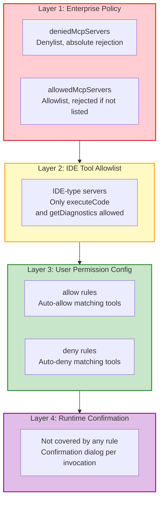
```mermaid
flowchart TD
    subgraph L1["Layer 1: Enterprise Policy"]
        direction LR
        D["deniedMcpServers\nDenylist, absolute rejection"]
        A["allowedMcpServers\nAllowlist, rejected if not listed"]
    end

    subgraph L2["Layer 2: IDE Tool Allowlist"]
        direction LR
        IDE["IDE-type servers\nOnly executeCode\nand getDiagnostics allowed"]
    end

    subgraph L3["Layer 3: User Permission Config"]
        direction LR
        Allow["allow rules\nAuto-allow matching tools"]
        Deny["deny rules\nAuto-deny matching tools"]
    end

    subgraph L4["Layer 4: Runtime Confirmation"]
        Confirm["Not covered by any rule\nConfirmation dialog per invocation"]
    end

    L1 --> L2 --> L3 --> L4

    classDef layer1 fill:#ffcdd2,stroke:#d32f2f,stroke-width:2px,color:#333
    classDef layer2 fill:#fff9c4,stroke:#f9a825,stroke-width:2px,color:#333
    classDef layer3 fill:#c8e6c9,stroke:#388e3c,stroke-width:2px,color:#333
    classDef layer4 fill:#e1bee7,stroke:#7b1fa2,stroke-width:2px,color:#333
    class L1 layer1
    class L2 layer2
    class L3 layer3
    class L4 layer4
```

This four-layer permission model follows the "Defense in Depth" principle: even if one layer's check is bypassed or misconfigured, other layers still provide protection. For example, even if a user allows all MCP tools in their permission configuration (`mcp__*`), enterprise administrators can still block dangerous servers through the denylist.

> **Cross-reference to Chapter 4:** This permission hierarchy is tightly integrated with the Permission Pipeline described in Chapter 4. MCP tool permission checks occur during the second stage (permission evaluation stage) of the pipeline, sharing the same check framework as built-in tools but with independent default behavior (passthrough vs. the possible auto-allow for built-in tools).

> **Anti-pattern Warning:** Do not use `"mcp__*": "allow"` in global configuration to allow all MCP tools. This "one-click open-all" approach, while convenient, bypasses security checks — any tools provided by newly connected MCP servers will be automatically allowed to execute, including tools you may not be familiar with. Authorize at the server or tool granularity level.

---

## 12.3 MCP Permissions and Security

Security is the most critical topic in MCP integration. Unlike built-in tools, MCP tools come from external third parties, and their behavior is unpredictable and uncontrollable. Therefore, Claude Code has built a multi-layered defense system for MCP, from configuration scopes to server approval, from tool allowlists to plugin deduplication — each layer targets specific security threats.

### 12.3.1 Configuration Scopes

MCP server configuration has seven scopes, each corresponding to different management levels and trust boundaries:

| Scope | Config Source | Management Level | Typical Use |
|--------|---------|---------|---------|
| `local` | `.claude/settings.local.json` | Project-personal | Developer's personal tools, not committed to version control |
| `project` | `.claude/settings.json` | Project-shared | Team-shared tool config, committed to version control |
| `user` | `~/.claude/settings.json` | User-global | Cross-project general tools (e.g., GitHub MCP) |
| `dynamic` | Dynamically added at runtime | Session-level | Temporarily added tools, disappear after session ends |
| `enterprise` | Enterprise management config | Organization-level | Enterprise-approved tool allowlists and denylists |
| `claudeai` | Claude.ai platform connectors | Platform-level | Claude.ai web interface tool connections |
| `managed` | Managed policy config | Admin-level | IT administrator-enforced policies |

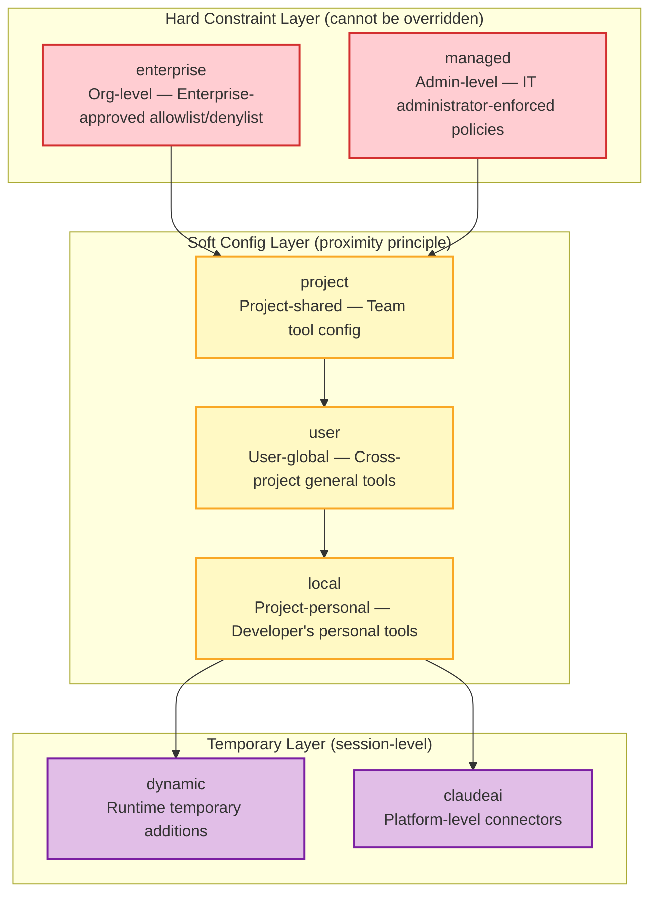
```mermaid
flowchart TD
    subgraph HardConstraints["Hard Constraint Layer (cannot be overridden)"]
        ENT["enterprise\nOrg-level — Enterprise-approved allowlist/denylist"]
        MGD["managed\nAdmin-level — IT administrator-enforced policies"]
    end

    subgraph SoftConfig["Soft Config Layer (proximity principle)"]
        PROJ["project\nProject-shared — Team tool config"]
        USR["user\nUser-global — Cross-project general tools"]
        LOC["local\nProject-personal — Developer's personal tools"]
    end

    subgraph Temporary["Temporary Layer (session-level)"]
        DYN["dynamic\nRuntime temporary additions"]
        CAI["claudeai\nPlatform-level connectors"]
    end

    ENT --> PROJ
    MGD --> PROJ
    PROJ --> USR
    USR --> LOC
    LOC --> DYN
    LOC --> CAI

    classDef hard fill:#ffcdd2,stroke:#d32f2f,stroke-width:2px,color:#333
    classDef soft fill:#fff9c4,stroke:#f9a825,stroke-width:2px,color:#333
    classDef temp fill:#e1bee7,stroke:#7b1fa2,stroke-width:2px,color:#333
    class ENT,MGD hard
    class PROJ,USR,LOC soft
    class DYN,CAI temp
```

**Scope Priority and Override Rules**

The priority of these seven scopes follows the "proximity principle": more specific scopes (such as local) take precedence over broader scopes (such as user), while management-level scopes (such as enterprise, managed) exist as hard constraints that cannot be overridden by lower-level scopes.

This design has the following security implications:

1. **Enterprise administrator decisions are final**: If the enterprise configuration prohibits an MCP server, even if a user adds that server in their local configuration, it will not take effect.
2. **Project configuration overrides personal configuration**: If project-level configuration enables specific tools, personal configuration cannot disable them (but can add additional tools).
3. **Runtime configuration is temporary**: Servers added via the dynamic scope are only valid for the current session and are not persisted.

> **Analogy:** The seven scopes are like a seven-level access control system in a building. The building entrance is the enterprise policy (only employees can enter), the floor entrance is the managed policy (you can only access your department's floor), the room door is the project configuration (only project members can enter), and the personal locker is the local configuration (only you can open it). Each level of access control operates independently, but combined they form a complete access control system.

> **Best Practice:** Configure general tools (such as GitHub, database clients) in the user scope; configure project-specific tools (such as project-specific API testing tools) in the project scope; configure personal preferences or experimental tools in the local scope.

### 12.3.2 Server Approval and Allowlists

Enterprise administrators can control which MCP servers are allowed through `allowedMcpServers` and `deniedMcpServers` policies. This is the core of the three-layer security strategy and the most important security control point when deploying Claude Code in enterprises.

**Why an Approval Mechanism?**

In enterprise environments, MCP servers can pose serious security risks: a malicious MCP server could execute arbitrary code during tool invocations, steal sensitive data, or even inject malicious instructions through tool input parameters. The approval mechanism lets enterprise administrators intercept servers before connections are established, shifting the security line forward to the "prevention" phase rather than the "detection" phase.

**Denylist: Absolute Priority**

The denylist has absolute priority — servers on the denylist will never be connected, regardless of which scope they appear in. Three matching methods are supported:

1. **Match by server name**: The simplest and most direct, matching by the server's registered name in the configuration.
2. **Match by command array**: For stdio servers, matching by the complete command-line arguments (`command` + `args`). This prevents users from bypassing the denylist by using a different name.
3. **Match by URL pattern**: For remote servers (SSE/HTTP/WS), supporting wildcard URL matching.

**Allowlist: Gate Control Mechanism**

If an allowlist is defined, only servers on the allowlist are permitted. The allowlist also supports name, command, and URL matching. The allowlist is a stricter security policy — deny everything by default, only allow what is explicitly approved. It's suitable for environments with extremely high security requirements (such as financial institutions, government agencies).

**URL Wildcard Matching Details**

URL pattern matching supports the `*` wildcard, enabling flexible matching of a group of related servers:

```
Exact match:
  "https://mcp.company.com/api"     matches only this URL

Wildcard match:
  "https://mcp.company.com/*"       matches all paths under mcp.company.com
  "https://*.company.com/*"         matches all subdomains and paths under company.com
  "https://mcp.company.com:*\/*"    matches any port

Practical matching examples:
  Pattern: "https://example.com/*"
  ✓ Matches "https://example.com/api/v1"
  ✓ Matches "https://example.com/tools/github"
  ✗ Does not match "https://api.example.com/tools" (different subdomain)

  Pattern: "https://*.example.com/*"
  ✓ Matches "https://api.example.com/path"
  ✓ Matches "https://mcp.example.com/tools"
  ✗ Does not match "https://example.com/path" (no subdomain)
```

**Design of the Policy Filter Function**

`filterMcpServersByPolicy` is the unified filter for all configuration entry points. Its execution logic can be summarized as:

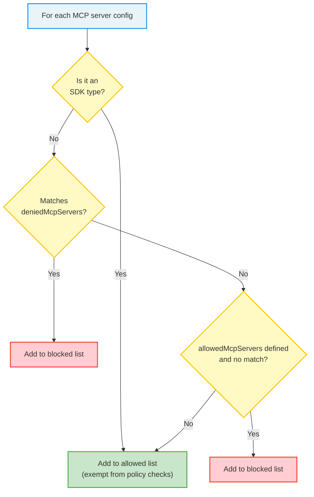
```mermaid
flowchart TD
    Input["For each MCP server config"] --> CheckSDK{"Is it an\nSDK type?"}
    CheckSDK -->|"Yes"| Allow["Add to allowed list\n(exempt from policy checks)"]
    CheckSDK -->|"No"| CheckDeny{"Matches\ndeniedMcpServers?"}
    CheckDeny -->|"Yes"| Block1["Add to blocked list"]
    CheckDeny -->|"No"| CheckAllow{"allowedMcpServers defined\nand no match?"}
    CheckAllow -->|"Yes"| Block2["Add to blocked list"]
    CheckAllow -->|"No"| Allow

    classDef allow fill:#c8e6c9,stroke:#4CAF50,stroke-width:2px,color:#333
    classDef block fill:#ffcdd2,stroke:#f44336,stroke-width:2px,color:#333
    classDef decision fill:#fff9c4,stroke:#FFC107,stroke-width:2px,color:#333
    classDef input fill:#e8f4f8,stroke:#2196F3,stroke-width:2px,color:#333
    class Allow allow
    class Block1,Block2 block
    class CheckSDK,CheckDeny,CheckAllow decision
    class Input input
```

SDK-type servers being exempt from policy checks is an important design decision. The reason is that SDK servers are transport placeholders managed by the SDK — the CLI doesn't start processes or open network connections for them. They run in the same process as Claude Code, with security boundaries guaranteed by the host application (i.e., the application embedding the Claude Code SDK), so CLI-level policy control is unnecessary.

> **Security Consideration:** The approval mechanism embodies the "Shift Left Security" philosophy. Rather than checking permissions at tool invocation time (when it may already be too late), it's better to intercept untrusted servers before connections are established. This preventive security measure costs very little (just configuration checks) but yields high returns (completely eliminates untrusted server access).

### 12.3.3 Plugin Deduplication

When a plugin-provided MCP server points to the same underlying process/URL as a manually configured server, the system automatically deduplicates. Deduplication may seem like a minor feature, but it's extremely important in practice — without it, the same MCP server might be connected multiple times, consuming double the resources, exposing duplicate tool lists (confusing the model), and even causing concurrency conflicts.

**The Signature Mechanism for Deduplication**

The deduplication function uses signature comparison to identify "identical" servers. The signature rules are as follows:

| Server Type | Signature Calculation | Example |
|-----------|-------------|------|
| `stdio` | `stdio:${JSON.stringify([command, ...args])}` | `stdio:["npx","-y","@mcp/server-filesystem","/tmp"]` |
| Remote server | `url:${originalUrl}` | `url:https://mcp.example.com/api` |
| `sdk` | `null` (no deduplication) | N/A |

**Deeper Meaning of Signatures**

stdio servers use the complete command array as the signature, meaning even if the server name or environment variables differ, as long as the same command is ultimately launched, they will be identified as duplicates. This is a correct security decision — deduplication should be based on "actual effect" rather than "surface configuration." If two configurations ultimately run the same program, they are duplicates.

Remote servers use the original URL as the signature. Notably, if the URL is a CCR (Claude Code Relay) proxy path, the system first unwraps it to obtain the real URL before calculating the signature. This prevents the same remote server from evading deduplication through different proxy paths.

SDK server signatures are null, meaning no deduplication. This is because SDK servers may be registered through different code paths — while the types are the same, the functionality may differ, and deduplication would cause functionality loss.

**Deduplication Priority: Who Wins?**

When duplicates are detected, the system determines which configuration to keep based on the following priority:

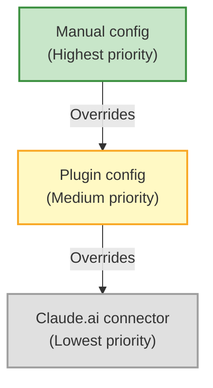
```mermaid
flowchart TD
    Manual["Manual config\n(Highest priority)"]
    Plugin["Plugin config\n(Medium priority)"]
    Connector["Claude.ai connector\n(Lowest priority)"]
    Manual -->|"Overrides"| Plugin
    Plugin -->|"Overrides"| Connector

    classDef high fill:#c8e6c9,stroke:#388e3c,stroke-width:2px,color:#333
    classDef mid fill:#fff9c4,stroke:#f9a825,stroke-width:2px,color:#333
    classDef low fill:#e0e0e0,stroke:#9E9E9E,stroke-width:2px,color:#333
    class Manual high
    class Plugin mid
    class Connector low
```

The design logic behind this priority is: the user's explicit configuration (manual config) reflects the user's clear intent and should always be respected. If a user manually configures an MCP server with custom parameters, a plugin-injected server with the same identity should not override the user's choice.

> **Practical Example:** A common scenario is when a team has a GitHub MCP server configuration automatically injected through a VS Code extension (plugin config), but a developer has already manually configured the same server in `.claude/settings.local.json` with different environment variables (such as a custom GitHub Token). The deduplication mechanism ensures the manual configuration wins — the developer's custom Token is used, not the extension's default configuration.

### 12.3.4 IDE Tool Allowlist

For IDE-integrated MCP servers, the system enforces an additional security layer — a tool allowlist restriction. Only the following two tools are allowed to be loaded from IDE MCP servers:

| Tool Name | Function | Security Consideration |
|--------|------|---------|
| `mcp__ide__executeCode` | Execute code in the IDE environment | Restricted to running in the IDE's sandbox context |
| `mcp__ide__getDiagnostics` | Get IDE diagnostic information (errors, warnings, etc.) | Read-only operation, does not modify any state |

**Why This Restriction?**

Behind this seemingly strict design is a well-considered security decision. IDE extensions are written by third-party developers and can expose arbitrary tools through the MCP protocol. Without an allowlist restriction, a malicious VS Code extension could expose a `deleteFiles` or `executeCommand` tool, and when a user uses that extension in Claude Code, these dangerous tools would be registered.

The allowlist's design philosophy is the "principle of least privilege" — IDE integration only needs two core capabilities: executing code (letting Claude Code run code snippets in the IDE context) and getting diagnostic information (letting Claude Code see compilation errors and code issues). Any functionality beyond this scope should not be exposed through the IDE MCP channel.

**When the Allowlist Is Enforced**

The allowlist check occurs during the tool discovery stage — after Claude Code retrieves the tool list from an IDE-type MCP server, it filters out tools not on the allowlist. This means tools not on the allowlist never appear in Claude Code's tool registry; the model doesn't even know they exist. This is more secure than "register but forbid invocation" because it eliminates the possibility of accidentally invoking these tools through configuration errors or permission bypasses.

> **Relationship to the Bridge System:** The IDE tool allowlist is part of the Bridge system's (Section 12.4) security model. IDEs communicate with Claude Code through the Bridge channel, and the tool allowlist ensures that even if the Bridge channel is exploited by a malicious extension, the attack surface is strictly limited to two safe tools.

---

## 12.4 IDE Integration: The Bridge System

The Bridge system is the core layer for bidirectional communication between Claude Code and the external world. It implements integration with IDEs like VS Code and JetBrains, as well as Claude.ai platform remote control functionality. If the MCP protocol is the "dialect" between Claude Code and tool servers, then the Bridge system is the "lingua franca" between Claude Code and the entire external world.

> **Analogy:** Think of Bridge as the dispatch system of a multilingual translation center. The translation center (Bridge) simultaneously handles calls from different countries (IDE, claude.ai, remote terminals), needs to select the correct translation protocol for each line (v1/v2 transport), ensures messages don't cross lines (deduplication), and controls who can call in (permission gating).

### 12.4.1 Architecture Overview

The Bridge system is located in the bridge communication directory, containing over 30 module files that form a complete communication layer. Its scale alone demonstrates the complexity of IDE integration and remote control — this isn't simple message forwarding but a complete communication middleware that includes routing, deduplication, authentication, transport abstraction, and session management.

Key components are as follows:

| Responsibility | Description | Design Pattern |
|------|------|---------|
| REST API client | Communicates with the claude.ai backend | Adapter pattern |
| Message routing and deduplication | Handles inbound/outbound messages | Chain of Responsibility pattern |
| Transport layer abstraction | Encapsulates v1 (HybridTransport) and v2 (SSE + CCR) | Strategy pattern |
| REPL bridge core | Manages session lifecycle | Observer pattern |
| Remote control core logic | Manages remote control functionality | Command pattern |
| Bridge feature gating and permission checks | Controls feature access | Decorator pattern |
| Type definitions | Defines communication types | Type-driven design |
| Session creation and subprocess management | Manages session lifecycle | Factory pattern |
| JWT utilities | Used for authentication | Utility class |

**Why So Many Modules?**

The Bridge system's complexity stems from needing to simultaneously satisfy requirements across multiple dimensions:

1. **Multi-transport protocol compatibility**: Must support both legacy (v1) and new (v2) transport protocols simultaneously, with smooth migration without affecting existing integrations.
2. **Bidirectional communication**: Not only does the CLI push messages outward, it also needs to receive external control commands (such as switching models, interrupting execution).
3. **Multi-session parallelism**: The same user may simultaneously use multiple terminals or IDE windows, each requiring independent session management.
4. **Security isolation**: Messages from different sources require different authentication and permission check strategies.

These requirements, layered together, evolved what could be a simple message forwarding module into a complete communication middleware.

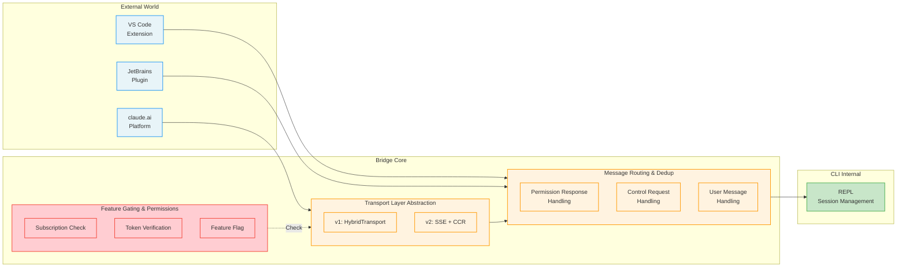
```mermaid
flowchart LR
    subgraph External["External World"]
        VS["VS Code\nExtension"]
        JB["JetBrains\nPlugin"]
        CAI["claude.ai\nPlatform"]
    end

    subgraph BridgeCore["Bridge Core"]
        subgraph Router["Message Routing & Dedup"]
            Perm["Permission Response\nHandling"]
            Ctrl["Control Request\nHandling"]
            User["User Message\nHandling"]
        end
        subgraph Transport["Transport Layer Abstraction"]
            V1["v1: HybridTransport"]
            V2["v2: SSE + CCR"]
        end
        subgraph Gate["Feature Gating & Permissions"]
            Sub["Subscription Check"]
            Token["Token Verification"]
            FF["Feature Flag"]
        end
    end

    subgraph CLI["CLI Internal"]
        REPL["REPL\nSession Management"]
    end

    VS --> Router
    JB --> Router
    CAI --> Transport
    Router --> REPL
    Transport --> Router
    Gate -.->|"Check"| Transport

    classDef ext fill:#e8f4f8,stroke:#2196F3,stroke-width:1.5px,color:#333
    classDef core fill:#fff3e0,stroke:#FF9800,stroke-width:1.5px,color:#333
    classDef gate fill:#ffcdd2,stroke:#f44336,stroke-width:1.5px,color:#333
    classDef cli fill:#c8e6c9,stroke:#4CAF50,stroke-width:1.5px,color:#333
    class VS,JB,CAI ext
    class Router,Perm,Ctrl,User,Transport,V1,V2 core
    class Gate,Sub,Token,FF gate
    class REPL cli
```

### 12.4.2 Bidirectional Communication Layer

Bridge's communication architecture is bidirectional, supporting two types of data flow. This bidirectionality is what distinguishes the Bridge system from simple "log pushing" — it doesn't just forward CLI output to the outside; it can also receive external commands and execute them.

**Outbound Flow (CLI -> External)**

Conversation messages, tool invocation results, status updates, and other data from the CLI are sent to external consumers (IDE, claude.ai, etc.) through the transport layer. Outbound messages include:

- Conversation messages (assistant and user roles)
- Tool invocation requests and results
- State change notifications (such as connection status, model switches)
- Errors and diagnostic information

Outbound messages are relatively simple — they are unidirectional pushes that don't need to handle complex synchronization and conflict issues.

**Inbound Flow (External -> CLI)**

User messages, permission responses, control requests, and other data from IDEs or claude.ai arrive at the CLI through the transport layer. Processing inbound messages is much more complex because they may change CLI state, requiring strict filtering and validation.

The core message routing logic implements triple filtering:

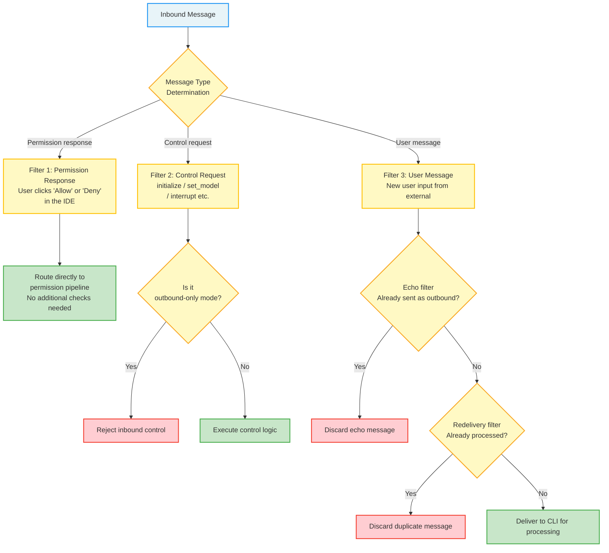
```mermaid
flowchart TD
    Inbound["Inbound Message"] --> Type1{"Message Type\nDetermination"}

    Type1 -->|"Permission response"| P1["Filter 1: Permission Response\nUser clicks 'Allow' or 'Deny'\nin the IDE"]
    P1 --> PermPipeline["Route directly to\npermission pipeline\nNo additional checks needed"]

    Type1 -->|"Control request"| P2["Filter 2: Control Request\ninitialize / set_model\n/ interrupt etc."]
    P2 --> CheckOutbound{"Is it\noutbound-only mode?"}
    CheckOutbound -->|"Yes"| Reject["Reject inbound control"]
    CheckOutbound -->|"No"| ExecCtrl["Execute control logic"]

    Type1 -->|"User message"| P3["Filter 3: User Message\nNew user input from external"]
    P3 --> EchoFilter{"Echo filter\nAlready sent as outbound?"}
    EchoFilter -->|"Yes"| Discard1["Discard echo message"]
    EchoFilter -->|"No"| RedeliverFilter{"Redelivery filter\nAlready processed?"}
    RedeliverFilter -->|"Yes"| Discard2["Discard duplicate message"]
    RedeliverFilter -->|"No"| Deliver["Deliver to CLI for processing"]

    classDef inbound fill:#e8f4f8,stroke:#2196F3,stroke-width:2px,color:#333
    classDef filter fill:#fff9c4,stroke:#FFC107,stroke-width:2px,color:#333
    classDef accept fill:#c8e6c9,stroke:#4CAF50,stroke-width:2px,color:#333
    classDef reject fill:#ffcdd2,stroke:#f44336,stroke-width:2px,color:#333
    classDef decision fill:#fff9c4,stroke:#f9a825,stroke-width:2px,color:#333
    class Inbound inbound
    class P1,P2,P3 filter
    class PermPipeline,ExecCtrl,Deliver accept
    class Reject,Discard1,Discard2 reject
    class Type1,CheckOutbound,EchoFilter,RedeliverFilter decision
```

**BoundedUUIDSet: Efficient Duplicate Detection**

`BoundedUUIDSet` is a FIFO (first-in, first-out) bounded set implemented using a ring buffer. It stores UUIDs of recently processed messages with a constant memory footprint of O(capacity). When a new message arrives, the system checks whether its UUID is in the set — if so, it's a duplicate message and is discarded immediately.

Why use a ring buffer instead of a simple Set? Consider a long-running session that may process tens of thousands of messages. If a regular Set stored all historical UUIDs, memory would grow continuously. The ring buffer achieves a balance between memory efficiency and duplicate detection accuracy by maintaining a fixed capacity, keeping only the UUIDs of the most recent N messages. The value of N is set large enough to cover the time window of network retransmissions (typically seconds to minutes), yet small enough not to cause memory pressure.

> **Connection to Chapter 2:** Bridge's bidirectional communication occurs at the outer layer of the dialog loop (Chapter 2). The dialog loop manages user-model interactions, while Bridge manages CLI-external world interactions. The two operate in parallel: Bridge can receive and buffer inbound messages during dialog loop execution, processing them after the current conversation turn completes.

### 12.4.3 Control Protocol

Servers can send control requests to remotely manage CLI sessions. The `handleServerControlRequest` function implements a lightweight Remote Procedure Call (RPC) protocol supporting the following control subtypes:

| Subtype | Purpose | Request Parameters | Response |
|--------|------|---------|------|
| `initialize` | Initialization handshake, report capabilities | Client capability declaration | commands, output_style, models, account, pid |
| `set_model` | Remotely switch model | Target model name | Success/failure status |
| `set_max_thinking_tokens` | Adjust thinking token budget | Token count | Success/failure status |
| `set_permission_mode` | Switch permission mode | Target mode name | Policy verdict result |
| `interrupt` | Interrupt current execution | None | Immediate interrupt |

**Design Principles of the Control Protocol**

The control protocol's design reflects several important principles:

1. **Minimal Control Surface**: Only five control subtypes, each with clear semantics and boundaries. This aligns with the "minimal API surface" design philosophy — fewer control commands mean easier security auditing and lower likelihood of misuse.

2. **Explicit Capability Negotiation**: `initialize` is the first and mandatory control request. It allows both parties to exchange capability declarations, ensuring subsequent control requests only send commands the other side supports. This "negotiate first, operate later" pattern is a classic network protocol design approach.

3. **Fire-and-forget Interrupt**: `interrupt` does not wait for a response and triggers the interrupt directly. This is the only "fire-and-forget" control command, designed to prioritize response speed over reliability — the interrupt operation needs to take effect immediately, and waiting for a response would delay its execution.

**Security Considerations for Outbound-only Mode**

In **outbound-only** mode, all mutable requests except `initialize` are rejected, returning an error message indicating that Remote Control must be enabled locally to allow inbound control.

This is a critical security boundary. Outbound-only mode means the CLI only pushes information outward and does not accept external control commands. This is particularly important for claude.ai integration — users may just want to view conversation history without allowing the web interface to remotely control their CLI session (such as switching models or interrupting execution).

Why is `initialize` still allowed in outbound-only mode? Because initialize is a read-only operation — it doesn't change any CLI state, only returning current capability information. Prohibiting initialize would prevent external clients from understanding the CLI's capabilities, making it impossible to correctly display conversation content.

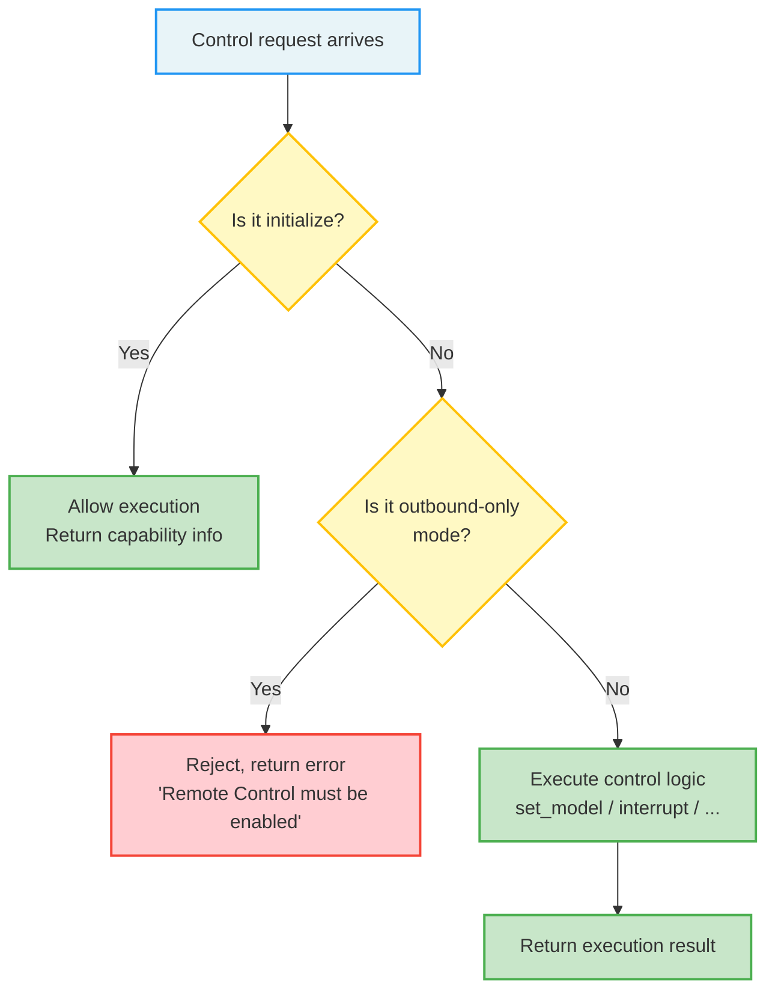
```mermaid
flowchart TD
    Request["Control request arrives"] --> InitCheck{"Is it initialize?"}
    InitCheck -->|"Yes"| AllowInit["Allow execution\nReturn capability info"]
    InitCheck -->|"No"| OutboundCheck{"Is it outbound-only\nmode?"}
    OutboundCheck -->|"Yes"| Reject["Reject, return error\n'Remote Control must be enabled'"]
    OutboundCheck -->|"No"| Execute["Execute control logic\nset_model / interrupt / ..."]
    Execute --> Result["Return execution result"]

    classDef start fill:#e8f4f8,stroke:#2196F3,stroke-width:2px,color:#333
    classDef decision fill:#fff9c4,stroke:#FFC107,stroke-width:2px,color:#333
    classDef accept fill:#c8e6c9,stroke:#4CAF50,stroke-width:2px,color:#333
    classDef reject fill:#ffcdd2,stroke:#f44336,stroke-width:2px,color:#333
    class Request start
    class InitCheck,OutboundCheck decision
    class AllowInit,Execute,Result accept
    class Reject reject
```

### 12.4.4 Transport Layer Abstraction

The transport layer defines a unified `ReplBridgeTransport` interface that encapsulates the complexity of underlying communication protocols behind a uniform abstraction. This is a classic application of the Strategy Pattern — upper-layer code interacts with the transport layer through a unified interface without needing to know whether the underlying protocol is WebSocket, SSE, or something else.

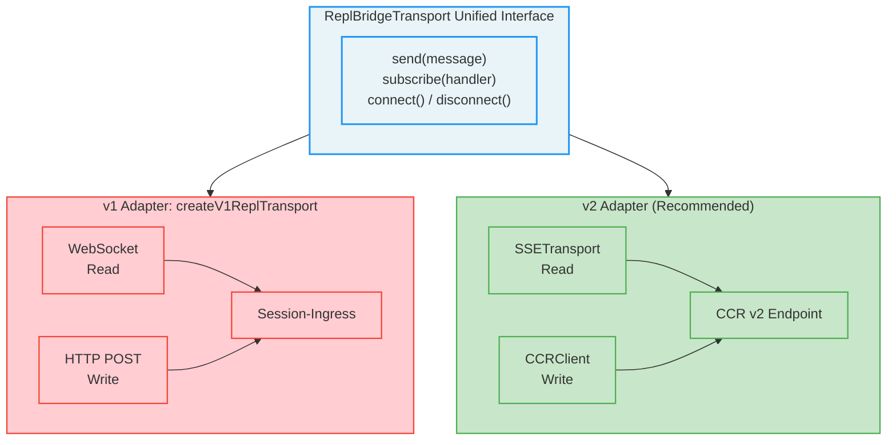
```mermaid
flowchart TD
    subgraph Interface["ReplBridgeTransport Unified Interface"]
        API["send(message)\nsubscribe(handler)\nconnect() / disconnect()"]
    end

    subgraph V1["v1 Adapter: createV1ReplTransport"]
        direction LR
        V1R["WebSocket\nRead"]
        V1W["HTTP POST\nWrite"]
        V1Target["Session-Ingress"]
    end

    subgraph V2["v2 Adapter (Recommended)"]
        direction LR
        V2R["SSETransport\nRead"]
        V2W["CCRClient\nWrite"]
        V2Target["CCR v2 Endpoint"]
    end

    Interface --> V1
    Interface --> V2
    V1R --> V1Target
    V1W --> V1Target
    V2R --> V2Target
    V2W --> V2Target

    classDef iface fill:#e8f4f8,stroke:#2196F3,stroke-width:2px,color:#333
    classDef v1 fill:#ffcdd2,stroke:#f44336,stroke-width:1.5px,color:#333
    classDef v2 fill:#c8e6c9,stroke:#4CAF50,stroke-width:1.5px,color:#333
    class Interface,API iface
    class V1,V1R,V1W,V1Target v1
    class V2,V2R,V2W,V2Target v2
```

**v1 Adapter** (`createV1ReplTransport`)

The v1 adapter wraps `HybridTransport`, using WebSocket for reading + HTTP POST for writing to the Session-Ingress service. The design intent behind this hybrid approach leverages each protocol's strengths: WebSocket is suited for server push (low latency, real-time), while HTTP POST is suited for client sending (simple, reliable, no long-lived connection maintenance).

The v1 adapter is a legacy solution that is still operational but no longer recommended for new feature development.

**v2 Adapter**

The v2 adapter wraps SSETransport (read) + CCRClient (write to CCR v2 endpoints), representing the future direction of the Bridge transport layer. Key improvements in v2 include:

**1. SSE Sequence Number Continuation**

This is v2's most elegant design. In traditional SSE implementations, when a client disconnects and reconnects, the server typically needs to replay all events since the connection began (because the client doesn't know what it missed). For long-running sessions, this can cause a "message storm" — thousands of historical messages replayed at once, consuming significant bandwidth and processing time.

v2's solution is: carry the previous stream's high-water sequence number mark during transport switching. When the client reconnects, it tells the server "I've processed up to sequence number N, please start from N+1." This way, the server only needs to send incremental messages, not the complete history.

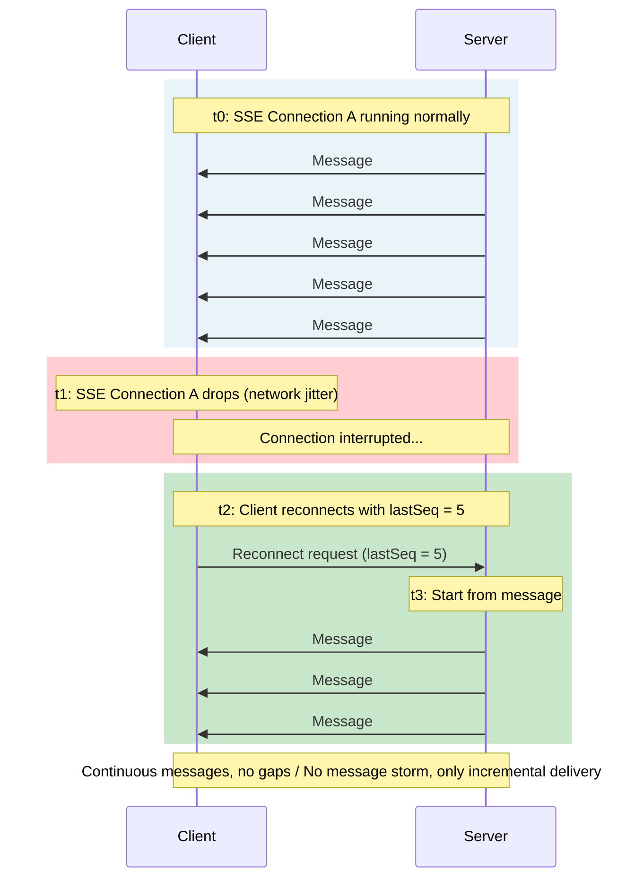
```mermaid
sequenceDiagram
    participant Client as Client
    participant Server as Server

    rect rgb(232, 244, 248)
        Note over Client,Server: t0: SSE Connection A running normally
        Server->>Client: Message #1
        Server->>Client: Message #2
        Server->>Client: Message #3
        Server->>Client: Message #4
        Server->>Client: Message #5
    end

    rect rgb(255, 205, 210)
        Note over Client: t1: SSE Connection A drops (network jitter)
        Note over Client,Server: Connection interrupted...
    end

    rect rgb(200, 230, 201)
        Note over Client,Server: t2: Client reconnects with lastSeq = 5
        Client->>Server: Reconnect request (lastSeq = 5)
        Note over Server: t3: Start from message #6 (not replaying from #1)
        Server->>Client: Message #6
        Server->>Client: Message #7
        Server->>Client: Message #8
    end

    Note over Client,Server: Continuous messages, no gaps / No message storm, only incremental delivery
```

**2. Epoch Management and Heartbeat**

CCRClient periodically sends heartbeats to maintain the lease. The Epoch is a monotonically increasing logical clock that increments with each transport switch. Through the Epoch, the system can distinguish between "delayed messages from old connections" and "new messages from new connections," avoiding processing of stale messages.

The heartbeat mechanism ensures connection liveness detection — if a heartbeat times out, the system considers the connection broken and triggers the reconnection flow. This works in conjunction with the exponential backoff retry mechanism described in Section 12.1.4.

**3. Multi-session Secure Authentication**

v2 provides per-instance authentication through closures rather than using global environment variables. This improvement solves a subtle but important concurrency issue: in multi-session scenarios, if multiple Bridge transport instances share the same authentication Token from an environment variable, when one instance refreshes the Token, other instances may read an inconsistent state.

The closure approach gives each transport instance its own authentication context, without mutual interference:

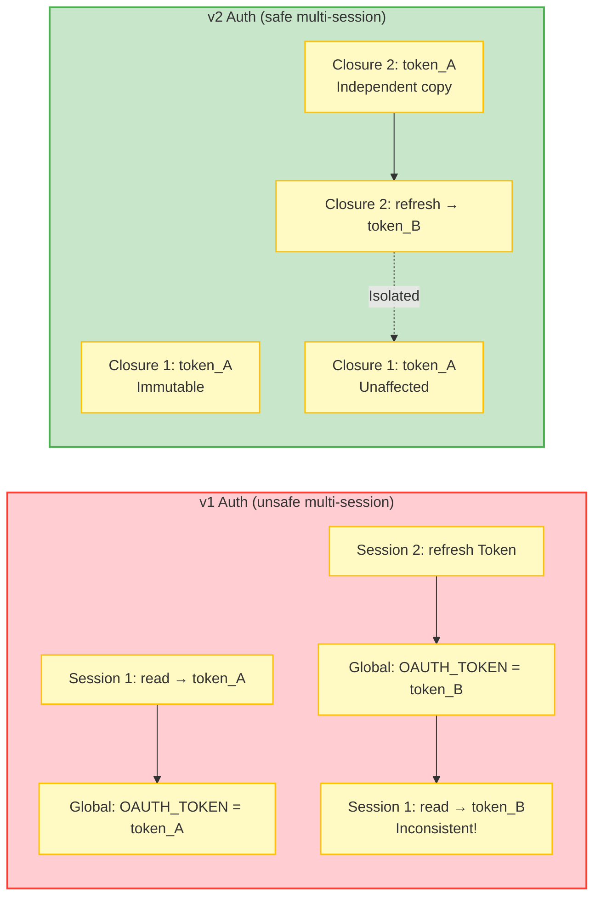
```mermaid
flowchart LR
    subgraph v1Unsafe["v1 Auth (unsafe multi-session)"]
        direction TB
        G1["Global: OAUTH_TOKEN = token_A"]
        S1a["Session 1: read → token_A"]
        S2a["Session 2: refresh Token"]
        G2["Global: OAUTH_TOKEN = token_B"]
        S1b["Session 1: read → token_B\nInconsistent!"]
        S1a --> G1
        S2a --> G2
        G2 --> S1b
    end

    subgraph v2Safe["v2 Auth (safe multi-session)"]
        direction TB
        C1["Closure 1: token_A\nImmutable"]
        C2a["Closure 2: token_A\nIndependent copy"]
        C2b["Closure 2: refresh → token_B"]
        C1c["Closure 1: token_A\nUnaffected"]
        C2a --> C2b
        C2b -.->|"Isolated"| C1c
    end

    classDef unsafe fill:#ffcdd2,stroke:#f44336,stroke-width:2px,color:#333
    classDef safe fill:#c8e6c9,stroke:#4CAF50,stroke-width:2px,color:#333
    classDef token fill:#fff9c4,stroke:#FFC107,stroke-width:1.5px,color:#333
    class v1Unsafe unsafe
    class v2Safe safe
    class G1,G2,C1,C2a,C2b,C1c token
    class S1a,S2a,S1b token
```

> **Architectural Reflection:** The evolution from v1 to v2 is a classic "technical debt cleanup" process. v1's hybrid approach (WebSocket + HTTP POST) quickly met early requirements, but as session counts grew and mobile integration was added, its limitations became apparent. v2 fundamentally solved these problems by introducing sequence number continuation and closure-based authentication, while preserving the same interface abstraction so upper-layer code required no modifications.

### 12.4.5 VS Code and JetBrains Extension Integration

IDE extensions communicate with the Claude CLI through `sse-ide` and `ws-ide` type MCP servers. These are internal-only types that add IDE identification information (such as IDE name, whether running on Windows) on top of the standard SSE/WebSocket protocols. This "protocol variant" design lets the Bridge system provide differentiated services based on client type.

**Integration Flow Details**

The complete IDE integration flow involves collaboration across multiple components:

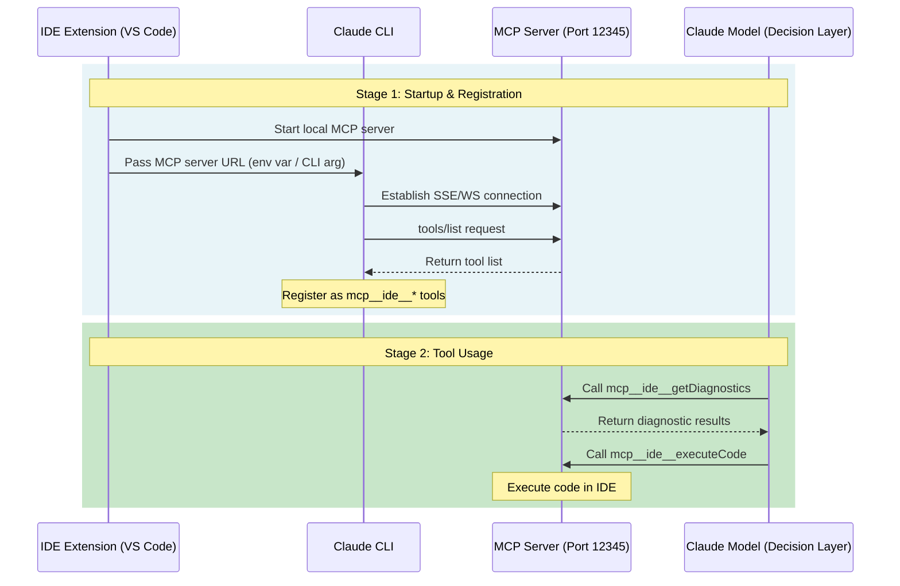
```mermaid
sequenceDiagram
    participant IDE as IDE Extension (VS Code)
    participant CLI as Claude CLI
    participant MCP as MCP Server (Port 12345)
    participant Model as Claude Model (Decision Layer)

    rect rgb(232, 244, 248)
        Note over IDE,Model: Stage 1: Startup & Registration
        IDE->>MCP: Start local MCP server
        IDE->>CLI: Pass MCP server URL (env var / CLI arg)
        CLI->>MCP: Establish SSE/WS connection
        CLI->>MCP: tools/list request
        MCP-->>CLI: Return tool list
        Note over CLI: Register as mcp__ide__* tools
    end

    rect rgb(200, 230, 201)
        Note over IDE,Model: Stage 2: Tool Usage
        Model->>MCP: Call mcp__ide__getDiagnostics
        MCP-->>Model: Return diagnostic results
        Model->>MCP: Call mcp__ide__executeCode
        Note over MCP: Execute code in IDE
    end
```

**Detailed Explanation of the Five Steps:**

1. **IDE extension starts the MCP server**: When the user opens the Claude Code extension in VS Code, the extension launches a local MCP server process listening on a randomly assigned local port.

2. **URL passing**: The IDE extension passes the server URL to Claude Code via environment variables (such as `CLAUDE_CODE_IDE_MCP_URL`) or CLI arguments. This URL typically looks like `http://127.0.0.1:12345/mcp`.

3. **Establishing the connection**: After starting, Claude Code reads the URL passed by the IDE and establishes a connection using the `sse-ide` or `ws-ide` protocol. Once connected, Claude Code becomes a client of this MCP server.

4. **Tool discovery**: Claude Code retrieves the IDE extension's tool list through the standard `tools/list` request. Since IDE-type servers are subject to the tool allowlist restriction, only `executeCode` and `getDiagnostics` are registered.

5. **Tool usage**: The Claude model can invoke these IDE tools when processing user requests to get real-time diagnostic information or execute code in the IDE context. For example, when the model suggests fixing a TypeScript type error, it can apply the fix directly in the IDE through `executeCode`, then verify the error has disappeared through `getDiagnostics`.

**Practical Value of IDE Integration**

The value of IDE integration goes far beyond "using Claude Code in the terminal." Through the MCP protocol, Claude Code gains "perception capabilities" of the IDE environment:

- **Real-time diagnostics**: `getDiagnostics` lets Claude Code see real-time compilation errors, type errors, and lint warnings in the IDE, without requiring users to manually copy-paste error messages.
- **Contextual execution**: `executeCode` lets Claude Code's code fixes execute in the IDE's full context (including the project's TypeScript configuration, Node.js version, environment variables, etc.), rather than in an isolated terminal environment.

> **Connection to Chapter 8's Hook System:** MCP tool invocations from IDE integration also trigger the hook system. For example, when Claude Code executes code in the IDE through `mcp__ide__executeCode`, the PreToolUse hook can intercept this call and check whether the code to be executed is safe. This adds an extra layer of security to IDE integration.

### 12.4.6 Bridge Permission Gating

Bridge (remote control) functionality is not open to all users — it requires a claude.ai subscription and passes through multiple gating layers. This "checkpoint upon checkpoint" design ensures remote control functionality is only used in controlled environments.

**Why Multiple Gating Layers?**

Remote control functionality allows external entities (IDE, claude.ai web interface) to control CLI sessions — switching models, adjusting parameters, even interrupting execution. If this capability were abused (for example, a malicious website controlling a user's CLI through an XSS attack), the consequences would be catastrophic. The multi-layer gating design follows the "defense in depth" principle — even if one layer's check is bypassed, other layers still provide protection.

The complete diagnostic function `getBridgeDisabledReason` checks four layers of conditions in sequence:

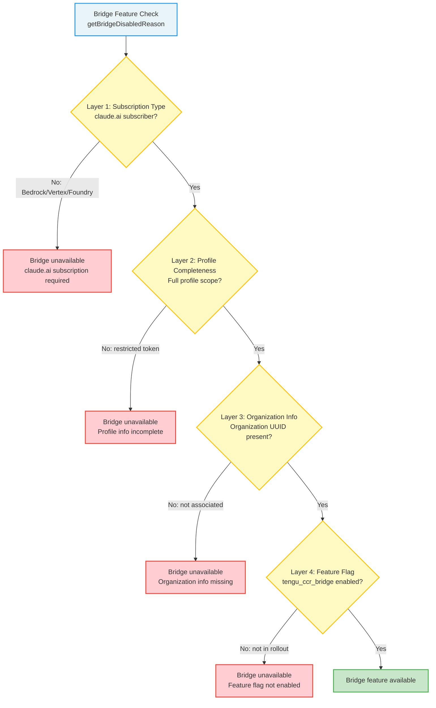
```mermaid
flowchart TD
    Start["Bridge Feature Check\ngetBridgeDisabledReason"] --> L1{"Layer 1: Subscription Type\nclaude.ai subscriber?"}
    L1 -->|"No: Bedrock/Vertex/Foundry"| Disabled1["Bridge unavailable\nclaude.ai subscription required"]
    L1 -->|"Yes"| L2{"Layer 2: Profile Completeness\nFull profile scope?"}
    L2 -->|"No: restricted token"| Disabled2["Bridge unavailable\nProfile info incomplete"]
    L2 -->|"Yes"| L3{"Layer 3: Organization Info\nOrganization UUID present?"}
    L3 -->|"No: not associated"| Disabled3["Bridge unavailable\nOrganization info missing"]
    L3 -->|"Yes"| L4{"Layer 4: Feature Flag\ntengu_ccr_bridge enabled?"}
    L4 -->|"No: not in rollout"| Disabled4["Bridge unavailable\nFeature flag not enabled"]
    L4 -->|"Yes"| Enabled["Bridge feature available"]

    classDef check fill:#fff9c4,stroke:#FFC107,stroke-width:2px,color:#333
    classDef disabled fill:#ffcdd2,stroke:#f44336,stroke-width:2px,color:#333
    classDef enabled fill:#c8e6c9,stroke:#4CAF50,stroke-width:2px,color:#333
    classDef start fill:#e8f4f8,stroke:#2196F3,stroke-width:2px,color:#333
    class L1,L2,L3,L4 check
    class Disabled1,Disabled2,Disabled3,Disabled4 disabled
    class Enabled enabled
    class Start start
```

**API Authentication and Token Management**

The API client authenticates using OAuth Bearer Tokens and supports automatic Token refresh and retry on 401 responses. This mechanism handles a common distributed systems problem: Token expiration.

```mermaid
flowchart TD
    Step1["1. Send API request\nwith current Bearer Token"] --> Step2{"2. Response received"}
    Step2 -->|"200 OK"| Success["Request successful"]
    Step2 -->|"401 Unauthorized"| Step3["3. Use Refresh Token\nto obtain new Bearer Token"]
    Step3 --> Step4["4. Retry original request\nwith new Token"]
    Step4 --> Step5{"5. Retry result"}
    Step5 -->|"200 OK"| Success
    Step5 -->|"401 Unauthorized"| Fail["Bridge feature unavailable\nNotify user"]

    classDef step fill:#e8f4f8,stroke:#2196F3,stroke-width:1.5px,color:#333
    classDef decision fill:#fff9c4,stroke:#FFC107,stroke-width:2px,color:#333
    classDef ok fill:#c8e6c9,stroke:#4CAF50,stroke-width:2px,color:#333
    classDef err fill:#ffcdd2,stroke:#f44336,stroke-width:2px,color:#333
    class Step1,Step3,Step4 step
    class Step2,Step5 decision
    class Success ok
    class Fail err
```

This "auto-refresh + retry" pattern is standard OAuth 2.0 practice. The benefit is that it's transparent to users — Token expiration won't interrupt an ongoing Bridge session, as the system handles it automatically in the background.

> **Best Practice:** If you need to use Bridge functionality in an enterprise environment, ensure: (1) team members sign in with claude.ai subscription accounts, not API Keys; (2) the organization UUID is correctly configured; (3) the network firewall permits SSE/CCR communication with the claude.ai backend.

---

## Hands-on Exercises

### Exercise 1: Configure a stdio-type MCP Server

Create `.mcp.json` in the project root directory:

```json
{
  "mcpServers": {
    "filesystem": {
      "type": "stdio",
      "command": "npx",
      "args": ["-y", "@modelcontextprotocol/server-filesystem", "/tmp"],
      "env": {}
    }
  }
}
```

After starting Claude Code, verify that the tools have loaded:
- Observe MCP connection status in the startup logs
- Try using tools with the `mcp__filesystem__*` prefix

**Advanced Challenge:**
- Modify `.mcp.json` to add custom environment variables for the filesystem server (e.g., restricting to read-only mode)
- Configure permission rules in `.claude/settings.local.json` to auto-allow `mcp__filesystem__read_file` while keeping a confirmation prompt for `mcp__filesystem__write_file`
- Test disabling the filesystem server after startup and observe how the tool list changes

### Exercise 2: Understand Tool Name Resolution

Based on the `mcp__{server}__{tool}` naming convention, analyze the following scenarios:
- What is the result of parsing `mcp__github__create_issue`?
- What input is needed to construct `mcp__my_server__read_file`?
- How will the tool name `mcp__my__special__tool` containing double underscores be parsed?

**Advanced Challenge:**
- If you simultaneously configure two servers named `github` and `git_hub`, and they provide identically named tools, how can you separately control them through permission configuration?
- In SDK mode (with `CLAUDE_AGENT_SDK_MCP_NO_PREFIX` set), if an MCP tool is named `Read`, how will it interact with the built-in Read tool?

### Exercise 3: Configure Enterprise-level MCP Security Policies

Set up allowlists and denylists in the enterprise management configuration:

```json
{
  "allowedMcpServers": [
    { "serverName": "approved-server" },
    { "serverCommand": ["npx", "-y", "@modelcontextprotocol/server-filesystem"] },
    { "serverUrl": "https://mcp.company.com/*" }
  ],
  "deniedMcpServers": [
    { "serverName": "dangerous-server" }
  ]
}
```

Test whether servers with different configurations are correctly allowed or blocked.

**Advanced Challenge:**
- Design a security policy that only allows internal company MCP servers (`*.company.com`) while blocking all external public servers
- Consider how to handle the case of "the same server being configured in different scopes" — if the enterprise configuration allows a server, but the local configuration has it on the denylist, what happens?

### Exercise 4: Multi-server Integration in Practice

Configure a complex environment with multiple MCP servers, simulating a real development workflow:

```json
{
  "mcpServers": {
    "github": {
      "type": "stdio",
      "command": "npx",
      "args": ["-y", "@modelcontextprotocol/server-github"],
      "env": { "GITHUB_PERSONAL_ACCESS_TOKEN": "ghp_xxxx" }
    },
    "database": {
      "type": "sse",
      "url": "https://internal-mcp.company.com/database",
      "headers": { "Authorization": "Bearer internal-token" }
    },
    "docs": {
      "type": "stdio",
      "command": "npx",
      "args": ["-y", "@modelcontextprotocol/server-brave-search"],
      "env": { "BRAVE_API_KEY": "BSA_xxxx" }
    }
  }
}
```

**Analysis Tasks:**
- What tools does each server register? What are the tools' fully qualified names?
- If the GitHub server fails to connect, will other servers be affected?
- How can you configure different permission levels for each server (e.g., full access for GitHub, read-only operations for the database)?

### Exercise 5: Understand Bridge Communication Flow

Analyze the Bridge communication behavior in the following scenarios:

**Scenario A**: The user sends the message "Fix all TypeScript errors" through the Claude Code extension in VS Code
1. How does the message travel from VS Code to the Claude CLI?
2. How does Claude Code call `getDiagnostics` to get error information?
3. After fixing the code, how is it applied in the IDE through `executeCode`?

**Scenario B**: The user remotely controls a running CLI session from the claude.ai web interface
1. The web interface sends a `set_model` request to switch to the Opus model — how does the CLI handle it?
2. If the CLI is currently executing a long-running tool call, how does the `interrupt` command stop it?
3. If the user doesn't have a claude.ai subscription, at which gating layer will they be rejected?

---

## Key Takeaways

1. **MCP's Design Mission**: MCP is the "USB-C port" of the AI world, solving the fragmentation problem in tool integration through a standardized protocol. Its three core design principles — Protocol as Contract, Transport Agnostic, and Security by Design — permeate Claude Code's entire MCP implementation.

2. **Layered Design of Eight Transport Protocols**: From the zero-overhead SDK (in-process calls) to the lowest-latency stdio (inter-process pipes), from the flexibly deployable SSE/HTTP (remote services) to full-duplex WebSocket (real-time communication), each protocol is optimized for specific deployment scenarios and network topologies. Prefer stdio; only use remote protocols when necessary.

3. **Security Value of Three-part Naming**: The `mcp__{server}__{tool}` naming convention not only solves tool name conflicts but, more importantly, provides independent namespaces during permission checks, preventing permission confusion between MCP tools and built-in tools. The prefix skip in SDK mode is an advanced feature that allows MCP tools to override built-in tools.

4. **Defense-in-Depth Security Architecture**: The four-layer permission model — enterprise policy (denylist > allowlist), IDE tool allowlist, user permission configuration, runtime confirmation — ensures that even if one layer's check is bypassed, other layers still provide protection. This is the complete embodiment of the "default distrust" security principle.

5. **Practical Wisdom of Signature-based Deduplication**: Through `stdio:JSON.stringify([cmd,...args])` and `url:originalUrl` signature mechanisms, the system ensures deduplication is based on "actual effect" rather than "surface configuration." The deduplication priority (manual > plugin > connector) guarantees that the user's explicit configuration always takes precedence.

6. **Complexity Management in Bridge Bidirectional Communication**: The 30+ module Bridge system abstracts v1/v2 transport differences through the unified `ReplBridgeTransport` interface, processes inbound messages through triple filtering (permission response > control request > user message), and achieves efficient deduplication through the `BoundedUUIDSet` ring buffer.

7. **SSE Sequence Number Continuation Is a Key Innovation**: The v2 transport carries the high-water sequence number mark during switching, avoiding full session history replay by the server. This seemingly minor improvement solves the "message storm" problem caused by transport switching in long-running sessions.

8. **Four-layer Permission Gating Ensures Remote Control Security**: The four-layer check of subscription type > profile completeness > organization info > feature flag, combined with OAuth Token auto-refresh, minimizes impact on user experience while maintaining security.

9. **IDE Integration's Perception Capabilities**: Through `sse-ide`/`ws-ide` protocols and the `executeCode`/`getDiagnostics` allowlisted tools, Claude Code gains real-time perception of the IDE environment — evolving from passively receiving user input to actively obtaining diagnostic information and executing operations in the IDE context.

10. **Collaboration with Other Systems**: MCP tools fully integrate into Claude Code's internal systems — going through tool system (Chapter 3) registration and scheduling, permission pipeline (Chapter 4) four-stage checks, and hook system (Chapter 8) lifecycle interception. MCP is not an isolated subsystem but a natural extension of Claude Code's tool ecosystem.

---

> **Next Chapter Preview:** Chapter 13 will dive into Claude Code's streaming architecture and performance optimization, exploring how to handle large data streams while maintaining real-time responsiveness — where streaming output from MCP tools is an important optimization scenario.
