# Chapter 15: Building Your Own Agent Harness

> "The rules of thinking are lengthy and fortuitous. They require plenty of thinking of most long duration and deep meditation for a wizard to wrap one's noggin around."
> -- Comment in Claude Code

**Learning Objectives:** Synthesize knowledge from the entire book to design and implement a custom Agent Harness, mastering the complete engineering pipeline from dialog loop to production deployment.

---

## 15.1 Design Principles Review and Selection Guide

### Five Design Principles in Practice

Five design principles for Agent Harnesses run throughout this book. Before writing code, let's review how they map to concrete engineering decisions. Understanding the "why" behind these principles matters more than memorizing the "what" -- because when you encounter scenarios in your own project that Claude Code doesn't cover, principles can guide you toward consistent design decisions.

**Principle 1: Loops over recursion.** Claude Code's core query function is an `AsyncGenerator` that manages state transitions through a `while(true)` loop and `continue` statements. Each iteration destructures the message list, compression tracking, recovery count, and other state from the `state` object, then writes a new `State` object at each `continue` site. This "destructure-reassign" pattern is easier to debug than recursive calls and avoids call stack overflow.

Why are loops better suited than recursion for Agent scenarios? Three reasons:

1. **State recovery is more natural.** In a loop, state recovery simply requires reassigning the `state` variable. In recursion, state recovery requires unwinding the entire call stack, with complexity increasing dramatically. Claude Code's auto-compact mechanism needs to compress context without terminating the conversation -- in a loop this is a simple "replace message list + continue," while in recursion it requires exceptions or special return values.

2. **Abort is more controllable.** The `AbortController` signal check at the top of the loop is a natural "exit point." In recursion, the abort signal must be passed and checked at every recursive level, making it easy to miss.

3. **Debugging is more intuitive.** State changes in a loop happen at a fixed code location -- a single breakpoint captures all state transitions. In recursion, state changes are scattered across multiple call stack frames, requiring breakpoints at different levels.

**Principle 2: Schema-driven, not hard-coded.** Each tool defines its input parameters through a Zod Schema, and the `buildTool` factory function automatically fills in default behavior from partial definitions. This means tool validation logic, permission checks, and description generation all derive from the same Schema, eliminating the root cause of inconsistencies.

The deeper value of Schema-driven design lies in "Single Source of Truth." Consider an alternative without Schema-driven design: input validation is written in one place, permission checks in another, and API documentation is manually authored. When a parameter needs modification, all three locations need synchronized updates, and missing any one leads to inconsistency. Schema-driven design ensures that validation logic, permission logic, and documentation all derive from the same definition -- modify one place and it takes effect globally.

**Principle 3: Progressive permissions.** The permission system is divided into four stages: `validateInput` (input validation), `checkPermissions` (permission check), PreToolUse hooks (pre-execution interception), and `canUseTool` (user confirmation). Each stage can short-circuit, and requests that don't pass a previous stage never enter the next one.

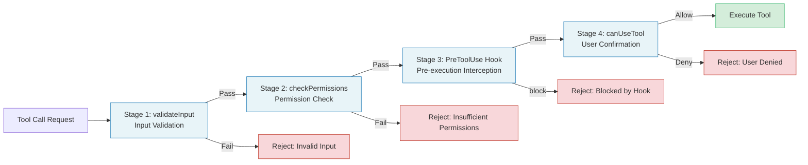

The benefit of this pipeline design is "early rejection" (Fail Fast). If input parameters are invalid (Stage 1), there's no need to waste time checking permission rules (Stage 2); if permission rules explicitly deny (Stage 2), there's no need to pop up a user confirmation dialog (Stage 4). Each stage acts as a "sieve," intercepting requests that don't need further processing as early as possible.

**Principle 4: Streaming first.** From model responses to tool execution results, all data flows through `AsyncGenerator`'s `yield`. Consumers can process messages one by one without waiting for the entire turn to complete. This makes real-time UI updates and streaming to SDK consumers possible.

**Principle 5: Pluggable extensions.** The hook system provides extension points at over twenty lifecycle nodes, from `SessionStart` to `PostToolUse`, from `PreCompact` to `Stop`. Each hook is an independent Shell command or HTTP endpoint that interacts with the Harness through a standardized JSON input/output protocol.

### When to Use Agent Harness Pattern vs. Simple LLM API Calls

Not every scenario requires a full Agent Harness. The decision hinges on three dimensions:

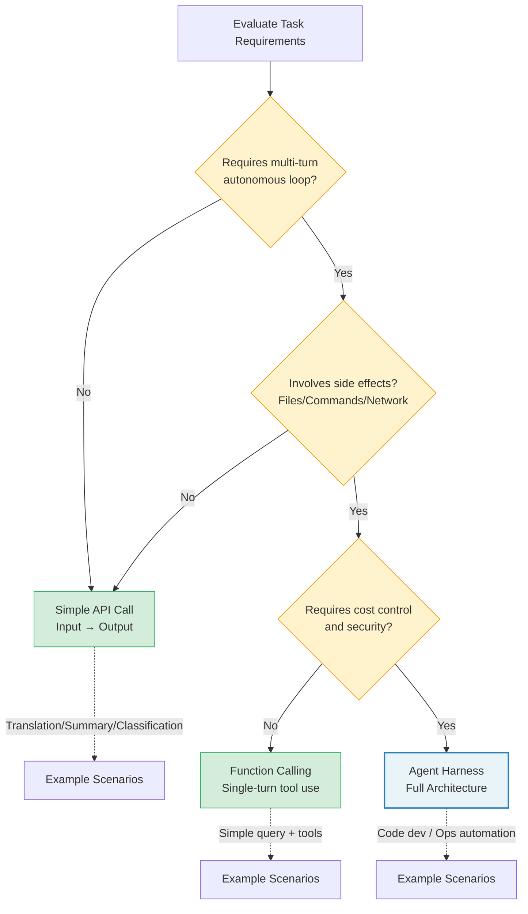

| Dimension | Simple API Call | Agent Harness |
|-----------|----------------|---------------|
| Interaction turns | Single request-response | Multi-turn autonomous loop |
| Tool requirements | None or Function Calling only | Multiple tools, permission control |
| Context management | Manual prompt assembly | Automatic compression, memory extraction |
| Error recovery | Retry | Multi-layer recovery (circuit breaker, fallback, compression) |
| Cost sensitivity | Low (single call) | High (accumulated over long sessions) |
| Security requirements | Low (no side effects) | High (file operations, command execution) |

If your task meets any of the following conditions, you should consider the Agent Harness pattern:

1. The agent needs to decide its next action based on intermediate results (autonomous loop)
2. Involves side-effect operations such as file system access, code execution, or network requests
3. Conversations may span dozens or even hundreds of turns
4. Needs to maintain consistent behavior across multiple environments (CLI, IDE, SDK)
5. Requires fine-grained cost control and token budget management
6. Needs observability -- tracking the decision process and resource consumption at every step

> **Decision rule of thumb:** If your system only needs the LLM to perform "input -> output" transformations (such as translation, summarization, classification), use a simple API call. If your system needs the LLM to perform an "observe -> think -> act -> observe again" loop, use an Agent Harness.

### Runtime Selection: Bun vs. Node.js vs. Python

Claude Code chose Bun as its runtime, primarily for three reasons:

- **Startup speed:** Bun's cold start time is roughly one-third that of Node.js, which is critical for CLI tools
- **Native TypeScript:** No pre-compilation step needed, runs `.ts` files directly
- **Bundle features:** `bun:bundle` provides compile-time feature flags (`feature('X')`), eliminating unnecessary code paths at build time

If your project primarily runs server-side and you already have Node.js infrastructure, Node.js works perfectly well. Python is suitable for data science and ML scenarios, but is weaker than TypeScript in type safety and tooling ecosystem. Code examples in this book are written in TypeScript and can run on both Bun and Node.js.

**Runtime selection trade-off matrix:**

```
+------------------+--------+---------+---------+
| Consideration    | Bun    | Node.js | Python  |
+------------------+--------+---------+---------+
| Startup speed    | Fast   | Medium  | Slow    |
| Native TypeScript| Yes    | Compile | No      |
| Package maturity | Medium | High    | High    |
| Feature flags    | Built-in| Tooling| Tooling |
| Deploy prevalence| Emerging| Wide   | Wide    |
| Type safety      | Strong | Strong  | Weak    |
| Async model      | Native | Native  | asyncio |
+------------------+--------+---------+---------+
```

---

## 15.2 Core Component Implementation Roadmap

The call relationships and data flow between the six core components of an Agent Harness are shown below:

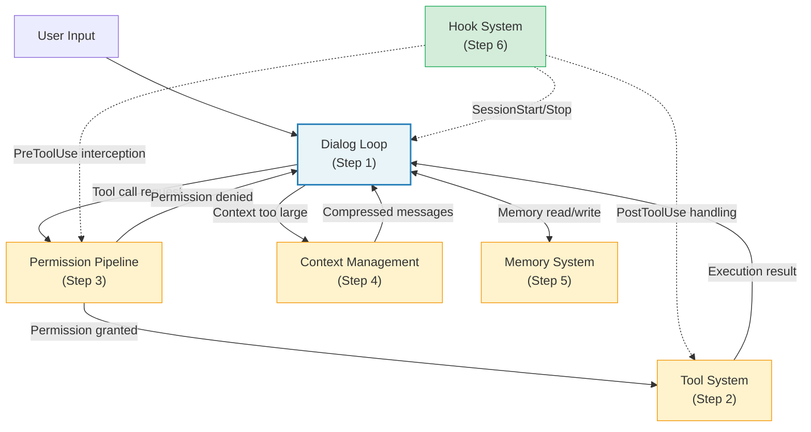

Building an Agent Harness is an incremental process. This section provides six steps, each building on the previous one, ultimately producing a minimal runnable Harness.

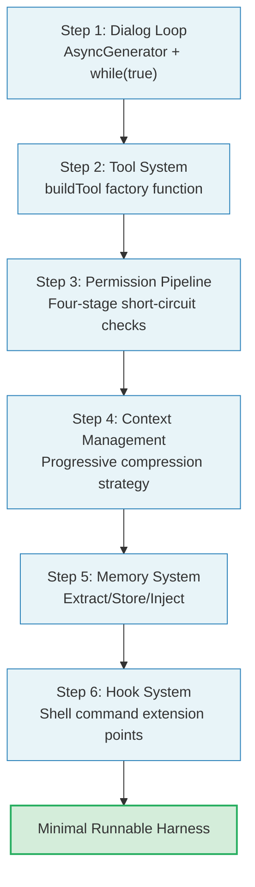

Don't be misled by the number "six steps" -- this is not a linear waterfall process. In practice, you'll find yourself iterating between steps: implementing the permission pipeline may require going back to modify the tool system's interface, and implementing context management may require adjusting the dialog loop's state structure. The six steps provide an ordered learning path, not a rigid development sequence.

### Step 1: Dialog Loop

The dialog loop is the heart of an Agent Harness. Claude Code's core query function is an `AsyncGenerator`. Let's draw inspiration from its design essence to implement a streamlined but complete dialog loop.

First, define the core types:

```typescript
// types.ts
export interface Message {
  role: 'system' | 'user' | 'assistant'
  content: string | ContentBlock[]
}

export interface ContentBlock {
  type: 'text' | 'tool_use' | 'tool_result'
  text?: string
  id?: string
  name?: string
  input?: Record<string, unknown>
  content?: string | ContentBlock[]
  is_error?: boolean
  tool_use_id?: string
}

export interface StreamEvent {
  type: 'assistant' | 'tool_results' | 'error' | 'complete'
  content?: unknown
}

export interface LoopState {
  messages: Message[]
  turnCount: number
  abortController: AbortController
}
```

Then implement the main loop. Note that this uses the same pattern as Claude Code: a `while(true)` loop with `continue` statements to manage state transitions:

```typescript
// agentLoop.ts
import type { Tool } from './toolSystem'

interface AgentDeps {
  callModel: (
    messages: Message[],
    tools: Tool[],
    signal: AbortSignal,
  ) => AsyncGenerator<ContentBlock[]>
  uuid: () => string
}

export async function* agentLoop(
  messages: Message[],
  tools: Tool[],
  deps: AgentDeps,
): AsyncGenerator<StreamEvent, { reason: string }> {
  let state: LoopState = {
    messages,
    turnCount: 0,
    abortController: new AbortController(),
  }

  while (true) {
    const { messages: currentMessages, abortController } = state

    // Collect assistant messages and tool calls for this iteration
    const assistantBlocks: ContentBlock[] = []
    const toolUseBlocks: ContentBlock[] = []

    try {
      // Stream model call
      for await (const block of deps.callModel(
        currentMessages,
        tools,
        abortController.signal,
      )) {
        assistantBlocks.push(block)
        if (block.type === 'tool_use') {
          toolUseBlocks.push(block)
        }
        yield {
          type: 'assistant' as const,
          content: block,
        }
      }
    } catch (error) {
      yield { type: 'error', content: String(error) }
      return { reason: 'model_error' }
    }

    // No tool calls -- conversation complete
    if (toolUseBlocks.length === 0) {
      yield { type: 'complete' }
      return { reason: 'completed' }
    }

    // Execute tools and collect results
    const toolResults: ContentBlock[] = []
    for (const toolCall of toolUseBlocks) {
      const tool = tools.find(t => t.name === toolCall.name)
      if (!tool) {
        toolResults.push({
          type: 'tool_result',
          tool_use_id: toolCall.id,
          content: `Unknown tool: ${toolCall.name}`,
          is_error: true,
        })
        continue
      }

      try {
        const result = await tool.execute(toolCall.input ?? {})
        toolResults.push({
          type: 'tool_result',
          tool_use_id: toolCall.id,
          content: JSON.stringify(result),
        })
      } catch (error) {
        toolResults.push({
          type: 'tool_result',
          tool_use_id: toolCall.id,
          content: `Tool error: ${error}`,
          is_error: true,
        })
      }

      yield { type: 'tool_results', content: toolResults }
    }

    // Update state and enter the next loop iteration
    state = {
      ...state,
      messages: [
        ...currentMessages,
        {
          role: 'assistant',
          content: assistantBlocks,
        },
        {
          role: 'user',
          content: toolResults,
        },
      ],
      turnCount: state.turnCount + 1,
    }
  }
}
```

This implementation embodies key design decisions distilled from Claude Code's source code:

1. **State object pattern:** Loop state is encapsulated in a single `state` variable, and each `continue` site writes a new `State` object (corresponding to `const next: State = { ... }` in the source code)
2. **Dependency injection:** The `deps` object encapsulates all I/O operations (model calls, UUID generation), allowing tests to inject mock implementations
3. **Generator output:** Events are passed one by one through `yield`, enabling consumers to respond in real time

**Extension considerations for Step 1:** This minimal implementation lacks several features essential for production environments. Before putting the dialog loop into actual use, you should consider adding:

- **Maximum turn limit**: Prevents infinite loops from consuming tokens. Claude Code uses a `maxTurns` parameter for control.
- **Abort mechanism**: Supports user cancellation of in-progress conversations via `AbortController`.
- **Error retry**: Retry logic for model call failures, including exponential backoff and fallback strategies.
- **Usage tracking**: Records token consumption per turn, supporting budget ceiling checks.

### Step 2: Tool System

Claude Code's tool system implements elegant default value population through the `buildTool` factory function. Each tool only needs to define its unique parts, while common behavior is provided by the factory. Let's implement a streamlined version:

```typescript
// toolSystem.ts
import { z } from 'zod'

export interface Tool {
  name: string
  description: string
  inputSchema: z.ZodType<{ [key: string]: unknown }>
  execute: (input: Record<string, unknown>) => Promise<unknown>
  // Default behaviors
  isEnabled: () => boolean
  isReadOnly: (input: unknown) => boolean
  isConcurrencySafe: (input: unknown) => boolean
  isDestructive: (input: unknown) => boolean
  checkPermissions: (
    input: Record<string, unknown>,
  ) => Promise<{ allowed: boolean; reason?: string }>
}

// Default value set -- corresponds to Claude Code's TOOL_DEFAULTS
const TOOL_DEFAULTS = {
  isEnabled: () => true,
  isReadOnly: () => false,
  isConcurrencySafe: () => false,
  isDestructive: () => false,
  checkPermissions: async () => ({ allowed: true }),
}

type ToolDef = Partial<typeof TOOL_DEFAULTS> &
  Omit<Tool, keyof typeof TOOL_DEFAULTS>

export function buildTool(def: ToolDef): Tool {
  return {
    ...TOOL_DEFAULTS,
    ...def,
  } as Tool
}
```

Usage example -- defining a file read tool:

```typescript
const readFileTool = buildTool({
  name: 'read_file',
  description: 'Read the contents of a file',
  inputSchema: z.object({
    path: z.string().describe('Absolute path to the file'),
    offset: z.number().optional().describe('Line number to start reading'),
    limit: z.number().optional().describe('Maximum lines to read'),
  }),
  isReadOnly: () => true,
  isConcurrencySafe: () => true,
  async execute(input) {
    const { path, offset, limit } = input as {
      path: string
      offset?: number
      limit?: number
    }
    const fs = await import('fs/promises')
    const content = await fs.readFile(path, 'utf-8')
    const lines = content.split('\n')
    const start = offset ?? 0
    const end = limit ? start + limit : lines.length
    return lines.slice(start, end).join('\n')
  },
})
```

The essence of `buildTool` lies in **fail-closed defaults**: `isConcurrencySafe` defaults to `false`, and `isReadOnly` defaults to `false`. This means the system assumes the most dangerous scenario for new tools until they explicitly declare their safety. This is emphasized in Claude Code's source code comments -- "assume not safe" and "assume writes."

**Fail-closed vs. Fail-open trade-offs:**

```
+------------------+--------------------------------+--------------------------------+
| Strategy         | Fail-closed (Claude Code's     | Fail-open                      |
|                  | choice)                        |                                |
+------------------+--------------------------------+--------------------------------+
| Default          | Tool is unsafe                 | Tool is safe                   |
| assumption       |                                |                                |
+------------------+--------------------------------+--------------------------------+
| New tool         | Sequential execution,          | Parallel execution,            |
| behavior         | confirmation required          | auto-approved                  |
+------------------+--------------------------------+--------------------------------+
| Risk of missing  | Slightly lower performance     | Security vulnerability         |
| annotations      | (unnecessary serialization)    | (dangerous ops run in parallel)|
+------------------+--------------------------------+--------------------------------+
| Suitable for     | Security-first production      | Development/experimentation    |
|                  | environments                   | phase                          |
+------------------+--------------------------------+--------------------------------+
```

> **Best Practice:** When developing new tools, start with fail-closed defaults. After confirming the tool behaves correctly, progressively add safety annotations (isReadOnly, isConcurrencySafe). This incremental approach avoids the "mark as safe first, discover it's unsafe later" rollback.

### Step 3: Permission Pipeline

Claude Code's permission check is a four-stage pipeline where each stage can short-circuit:

```typescript
// permissions.ts
export type PermissionDecision =
  | { allowed: true }
  | { allowed: false; reason: string }

export async function checkToolPermission(
  tool: Tool,
  input: Record<string, unknown>,
  context: PermissionContext,
): Promise<PermissionDecision> {
  // Stage 1: Tool's own validation (corresponds to validateInput)
  if (tool.validateInput) {
    const validation = await tool.validateInput(input, context)
    if (!validation.result) {
      return { allowed: false, reason: validation.message }
    }
  }

  // Stage 2: Tool's own permission check (corresponds to checkPermissions)
  const toolPermission = await tool.checkPermissions(input)
  if (!toolPermission.allowed) {
    return { allowed: false, reason: toolPermission.reason ?? 'Denied by tool' }
  }

  // Stage 3: User-configured rule matching
  const ruleDecision = matchPermissionRules(tool.name, input, context.rules)
  if (ruleDecision !== 'unknown') {
    return ruleDecision === 'allow'
      ? { allowed: true }
      : { allowed: false, reason: `Blocked by ${ruleDecision} rule` }
  }

  // Stage 4: User interactive confirmation (interactive mode only)
  if (context.mode === 'interactive') {
    const userChoice = await context.promptUser(
      `Allow ${tool.name} to execute?`,
    )
    return userChoice
      ? { allowed: true }
      : { allowed: false, reason: 'User denied' }
  }

  return { allowed: false, reason: 'Non-interactive: no matching rule' }
}
```

**Extension considerations for the permission pipeline:** Production permission systems typically need the following enhancements:

1. **Audit logging**: Record the tool name, input summary, decision result, and decision reason for every permission decision.
2. **Dynamic rule updates**: Support adding/removing permission rules at runtime without restarting the Agent.
3. **Permission caching**: Cache permission decisions for frequently called read-only tools (such as Read) to reduce latency.
4. **Role-based access control**: In multi-user scenarios, different user roles have different permission rule sets.

> **Cross-reference:** The complete design of the permission pipeline is analyzed in depth in Chapter 4, "The Permission Pipeline -- Agent Guardrails." The implementation in this chapter is a minimal version; production environments should refer to the complete design in Chapter 4.

### Step 4: Context Management

Long conversations inevitably hit token limits. Claude Code employs a **progressive compression strategy** composed of multiple tiers:

```typescript
// contextManager.ts
export interface CompressionStrategy {
  name: string
  shouldTrigger: (tokenCount: number, limit: number) => boolean
  compress: (messages: Message[]) => Promise<Message[]>
}

// Strategy 1: History snipping (cheapest)
const snipStrategy: CompressionStrategy = {
  name: 'snip',
  shouldTrigger: (count, limit) => count > limit * 0.7,
  async compress(messages) {
    // Keep system messages and the most recent N messages
    const systemMsgs = messages.filter(m => m.role === 'system')
    const recentMsgs = messages.slice(-20)
    return [...systemMsgs, ...recentMsgs]
  },
}

// Strategy 2: Summary compression (medium cost)
const summaryStrategy: CompressionStrategy = {
  name: 'summary',
  shouldTrigger: (count, limit) => count > limit * 0.9,
  async compress(messages) {
    // Use LLM to generate a conversation summary
    const summary = await generateSummary(messages)
    return [
      messages[0], // System message
      {
        role: 'user',
        content: `[Conversation summary]\n${summary}`,
      },
    ]
  },
}

export class ContextManager {
  private strategies: CompressionStrategy[] = [
    snipStrategy,
    summaryStrategy,
  ]

  async manageContext(
    messages: Message[],
    tokenCount: number,
    tokenLimit: number,
  ): Promise<{ messages: Message[]; wasCompressed: boolean }> {
    for (const strategy of this.strategies) {
      if (strategy.shouldTrigger(tokenCount, tokenLimit)) {
        const compressed = await strategy.compress(messages)
        return { messages: compressed, wasCompressed: true }
      }
    }
    return { messages, wasCompressed: false }
  }
}
```

**Design trade-offs for compression strategies:**

```
+----------+----------+-----------+---------------------------+
| Strategy | Token    | Info Loss | Suitable Scenarios        |
|          | Savings  |           |                           |
+----------+----------+-----------+---------------------------+
| Snip     | 20-40%   | High      | Quick space release,      |
|          |          |           | non-critical conversations|
+----------+----------+-----------+---------------------------+
| Micro-   | 30-50%   | Medium    | Preserve structure,       |
| compress |          |           | compress tool results     |
+----------+----------+-----------+---------------------------+
| Summary  | 70-90%   | Low       | Essential for long        |
|          |          | (lossy)   | conversations, preserves  |
|          |          |           | key information           |
+----------+----------+-----------+---------------------------+
```

Key insight: **Information loss is relative.** Snip discards complete tool results but preserves conversation structure. Summary compression preserves semantic information but loses original phrasing. Which strategy to choose depends on what information matters most in the conversation -- if the user is debugging a complex bug, tool results (such as log output) may be the least expendable; if the user is performing a code refactoring, the overall design decisions matter more than intermediate steps.

> **Cross-reference:** Claude Code's four-tier compression strategy is fully analyzed in Chapter 7, "Context Management -- Agent Working Memory." The two-tier strategy in this chapter is a simplified version.

### Step 5: Memory System

```typescript
// memory.ts
export interface MemoryEntry {
  content: string
  source: 'extracted' | 'explicit' | 'project_file'
  timestamp: number
  relevance: number
}

export class MemoryStore {
  private store: Map<string, MemoryEntry> = new Map()

  async extractAndStore(messages: Message[]): Promise<void> {
    // Extract key information from conversations and persist
    const lastExchange = messages.slice(-4)
    const extraction = await extractKeyFacts(lastExchange)
    for (const fact of extraction.facts) {
      this.store.set(fact.key, {
        content: fact.value,
        source: 'extracted',
        timestamp: Date.now(),
        relevance: fact.relevance,
      })
    }
  }

  getRelevantMemories(query: string, limit = 5): MemoryEntry[] {
    return Array.from(this.store.values())
      .filter(m => m.relevance > 0.3)
      .sort((a, b) => b.relevance - a.relevance)
      .slice(0, limit)
  }
}
```

**Design challenges for the memory system:** The memory system faces three core challenges, each corresponding to a design decision:

1. **What to extract?** Not all conversation content is worth remembering. User preferences ("I prefer Jest over Vitest"), project conventions ("this project uses camelCase naming"), and important decisions ("chose Redis over Memcached for caching") are high-value memories. Temporary debug output and intermediate step file contents are low-value memories.

2. **How long to store?** Memory has a decay curve. Conversation context from a week ago may no longer be relevant (the code has been rewritten). A good memory system needs to determine retention time based on a memory's "timeliness" and "reference frequency."

3. **When to inject?** Memories should not be injected in full on every request -- that would waste tokens and dilute key information. Memories should be selectively injected based on relevance to the current conversation, choosing only the most relevant fragments.

> **Cross-reference:** The complete design of the memory system is analyzed in detail in Chapter 6, "The Memory System -- Agent Long-Term Memory," including the CLAUDE.md storage format and session memory extraction strategies.

### Step 6: Hook System

The hook system is the extension layer of the Agent Harness. Claude Code supports over twenty hook events, each being an independent Shell command. Here is a streamlined implementation:

```typescript
// hooks.ts
export type HookEvent =
  | 'pre_tool_use'
  | 'post_tool_use'
  | 'session_start'
  | 'session_end'
  | 'stop'

export interface HookConfig {
  event: HookEvent
  command: string
  matcher?: string // Tool name matching pattern
}

export interface HookResult {
  outcome: 'success' | 'blocking' | 'error'
  decision?: 'approve' | 'block'
  reason?: string
  updatedInput?: Record<string, unknown>
}

export class HookRunner {
  constructor(private config: HookConfig[]) {}

  async runHooks(
    event: HookEvent,
    input: Record<string, unknown>,
    toolName?: string,
  ): Promise<HookResult[]> {
    const matching = this.config.filter(h => {
      if (h.event !== event) return false
      if (h.matcher && toolName && !h.matcher.includes(toolName)) return false
      return true
    })

    const results: HookResult[] = []
    for (const hook of matching) {
      const result = await this.executeHook(hook, input)
      results.push(result)
      // Blocking result short-circuits
      if (result.outcome === 'blocking') break
    }
    return results
  }

  private async executeHook(
    hook: HookConfig,
    input: Record<string, unknown>,
  ): Promise<HookResult> {
    const { spawn } = await import('child_process')
    return new Promise(resolve => {
      const child = spawn(hook.command, [], {
        shell: true,
        env: { ...process.env, HOOK_INPUT: JSON.stringify(input) },
        timeout: 10_000,
      })
      let stdout = ''
      child.stdout?.on('data', d => (stdout += d))
      child.on('close', code => {
        if (code !== 0) {
          resolve({
            outcome: code === 2 ? 'blocking' : 'error',
            reason: stdout,
          })
        } else {
          resolve({ outcome: 'success' })
        }
      })
    })
  }
}
```

**Extension considerations for the hook system:** Production hook systems need attention in the following areas:

1. **Timeout management**: Shell command execution time is unpredictable. Claude Code sets a 10-second timeout; timed-out hooks are treated as errors rather than blocking, ensuring that a slow hook doesn't stall the entire dialog loop.

2. **Error tolerance**: Hook failures should not cause the Agent to stop working. Hooks are "advisors" not "commanders" -- their output influences decisions but doesn't control flow.

3. **Security isolation**: Hook commands execute in separate processes, isolated from the Agent's main process. This prevents malicious hooks from affecting Agent behavior by modifying global variables or hijacking the module system.

4. **Audit trail**: Record each hook's execution time, return code, and output for debugging and compliance auditing.

> **Cross-reference:** The complete design of the hook system is analyzed in detail in Chapter 8, "The Hook System -- Agent Lifecycle Extension Points."

---

## 15.3 Architectural Lessons from Claude Code

### Breaking Circular Dependencies

In a codebase with over sixty tools and hundreds of modules, circular dependencies are the number one architecture killer. Claude Code employs multiple strategies to break cycles:

**Lazy Require pattern.** Conditional modules are loaded at runtime through `require()`, combined with feature flags, so unused modules are never loaded. The pattern is: use a feature flag to determine whether to load, fetch the module via `require()` when enabled, and return null when disabled.

This pattern defers imports from compile time to runtime, and combined with feature flags, ensures that unused modules are never loaded. This is the standard approach for handling optional heavy dependencies in the TypeScript ecosystem.

**Centralized type exports.** Another key strategy is importing types from a centralized location rather than from implementation modules. This decouples type definitions from implementations -- tool files don't need to import the entire permission system to get type signatures; they only need to import types from the centralized export location.

**Diagnosing circular dependencies.** How do you tell if your project is plagued by circular dependencies? Here are some symptoms:

1. **Startup time grows non-linearly with module count** -- module loading becomes a directed graph requiring depth-first traversal
2. **`undefined` surprises** -- imported values are `undefined` in certain code paths because the module hasn't finished initializing
3. **Modifying one file triggers mass recompilation** -- TypeScript's incremental compilation degrades in the face of circular dependencies

Methodology for breaking circular dependencies:

```
1. Draw the dependency graph (using madge or dependency-cruiser)
2. Identify cycles (find all loops)
3. Analyze each cycle's root cause:
   - Type dependency vs. runtime dependency?
   - Can it be broken through interface/type centralized exports?
   - Can it be broken through lazy require deferred loading?
   - Does it need a mediator module to decouple?
4. Break them one at a time, solving only one cycle per iteration
5. Add CI checks to prevent new circular dependencies
```

### Modular Design for Large Codebases

Claude Code's modularization strategy follows a core principle: **every tool is an independent citizen.** Tools are defined through the `buildTool` factory function, enjoying a uniform interface while maintaining internal autonomy. The `Tool` type defines over twenty methods, but only a few are required (`call`, `description`, `inputSchema`, `name`), with the rest having sensible defaults.

The `Tools` type is defined as `readonly Tool[]` rather than a regular array -- this is intentional design. Once a tool collection is created, it should not be modified; any changes should be made by creating a new collection.

This immutable collection design brings several benefits:

1. **Security guarantee**: No code can secretly add or remove tools at runtime; the tool list remains fixed once determined at creation.
2. **Simplified reasoning**: No need to consider "the tool list changed during execution" scenarios, reducing the complexity of concurrency issues.
3. **Cache-friendly**: The tool list's hash value is fixed and can be used as part of a cache key.

### Feature Flag-Driven Progressive Releases

Claude Code uses Bun's `bun:bundle` feature to implement compile-time feature flags. Code blocks wrapped in `feature('X')` functions are completely absent from the build output when not enabled, with no branch prediction penalty. For production systems that need progressive releases, this is a pattern worth adopting.

**Layered feature flag strategy:**

```
+-------------------+----------------------------+---------------------------+
| Flag Type         | Lifecycle                  | Suitable Scenarios        |
+-------------------+----------------------------+---------------------------+
| Compile-time flag | Permanent (determined at   | Incomplete features,      |
| (feature())       | build time)                | A/B testing               |
+-------------------+----------------------------+---------------------------+
| Runtime config    | Session-level (can vary    | User preferences,         |
| flag              | per startup)               | environment differences   |
| (settings.json)   |                            |                           |
+-------------------+----------------------------+---------------------------+
| Remote feature    | Real-time (API-driven)     | Gradual rollout,          |
| flag              |                            | emergency disabling       |
| (feature flag     |                            |                           |
|  service)         |                            |                           |
+-------------------+----------------------------+---------------------------+
```

Each flag type has its appropriate use case. Compile-time flags are suitable for features you're "certain aren't needed"; runtime configuration is suitable for features that "differ across environments"; remote feature flags are suitable for features that "need rapid toggling." Choosing the wrong flag type introduces unnecessary complexity -- for example, implementing user preferences with compile-time flags means every preference change requires a rebuild.

### Error Handling and the Circuit Breaker Pattern

Claude Code's error handling demonstrates a multi-layered defense system:

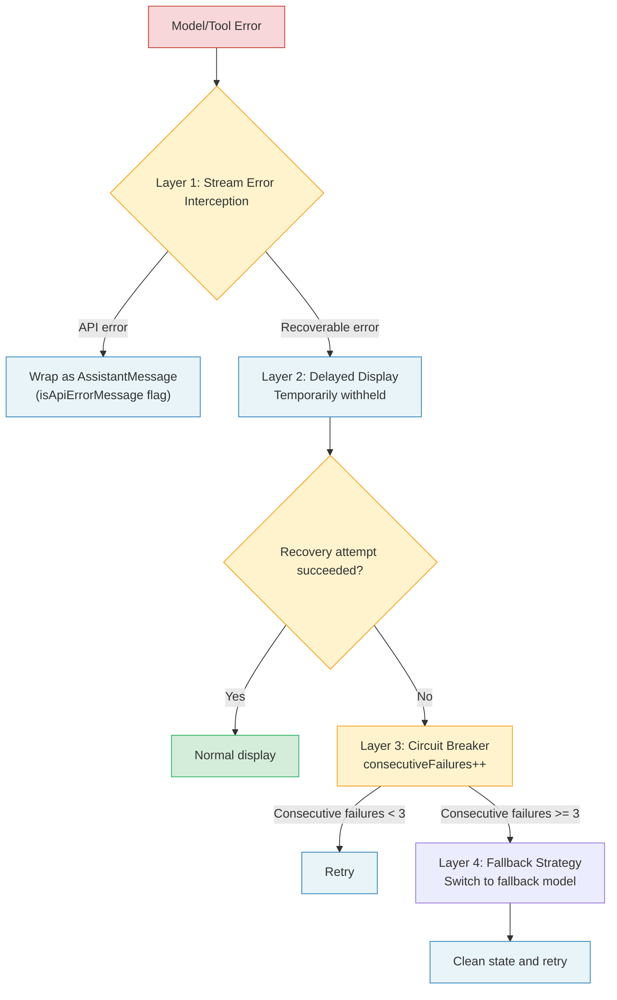

1. **Stream error interception:** Errors returned by the model are wrapped as `AssistantMessage` (with `isApiErrorMessage` flag) rather than thrown as exceptions
2. **Delayed display:** Recoverable errors (such as prompt-too-long) are temporarily withheld, with a recovery attempt made before deciding whether to display
3. **Circuit breaker:** Compression failure count is tracked (`consecutiveFailures`), and retries stop after reaching the threshold
4. **Fallback strategy:** When the model is unavailable, it automatically switches to a fallback model, cleaning state before retrying

The circuit breaker implementation is particularly elegant. In the source code, the `autoCompactTracking`'s `consecutiveFailures` field increments after each compression failure and resets on success. When the consecutive failure count exceeds the threshold, the loop exits directly rather than retrying indefinitely.

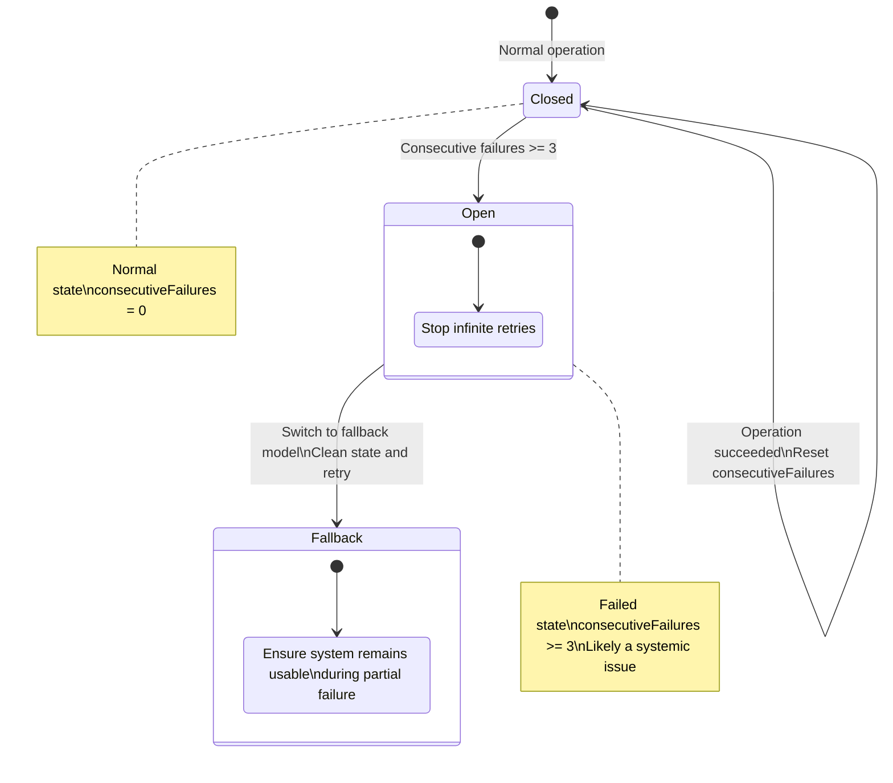

**Design dimensions for the circuit breaker pattern:** When implementing a circuit breaker, the following parameters need to be decided:

| Parameter | Claude Code's Choice | Considerations |
|-----------|---------------------|----------------|
| Failure threshold | 3 consecutive failures | Too low gives up too early, too high wastes resources |
| Recovery strategy | Reset counter on success | Simpler than half-open state |
| Fallback plan | Switch to fallback model | Ensures system remains usable during partial failure |
| Timeout | No fixed timeout | Controlled by loop-level maximum turn limit |

> **Anti-pattern Warning:** Don't implement a circuit breaker that "never triggers" -- such as setting the threshold to 100. The value of a circuit breaker lies in failing fast; an excessively high threshold is equivalent to having no circuit breaker at all. Claude Code chose 3 because observational data shows that if compression fails 3 times consecutively, it's most likely a systemic issue (such as API service degradation), and continued retries won't succeed.

### In-Depth Discussion on Observability

Observability for a production-grade Agent Harness goes beyond "logging" -- it's a systematic, layered design:

**Layer 1: Structured logs.** Every critical operation outputs structured log entries containing the operation type, duration, input summary, and output summary. Claude Code's approach is to instrument key paths, recording metrics such as message count, tool result count, query chain ID, and query depth.

```
{
  "event": "tool_execution",
  "tool": "read_file",
  "duration_ms": 45,
  "input_size": 128,
  "output_size": 15234,
  "cache_hit": true,
  "query_chain_id": "abc123",
  "turn_number": 5
}
```

**Layer 2: Aggregated metrics.** Aggregated data extracted from structured logs, used for dashboard display and alerting.

- **Latency distribution:** Model call latency and tool execution latency per loop turn
- **Token budget:** Input/output token consumption trends, compression frequency
- **Error rate:** Failure rates categorized by error type (model errors, tool errors, permission denials)
- **Behavioral metrics:** Average tool calls per turn, average turns to completion, user interruption rate

**Layer 3: Distributed tracing.** In multi-Agent scenarios, a single user request may trigger multiple sub-Agents. Distributed tracing links all related operations through a unique `query_chain_id`, allowing you to trace from a single user request to all sub-Agent behaviors.

**Layer 4: Anomaly detection.** Anomaly detection based on historical data, automatically identifying abnormal behavior patterns:
- Abnormal increase in tool calls per turn -- the Agent may be stuck in a loop
- Sudden spike in token consumption -- a tool may have returned unexpectedly large amounts of data
- Sudden rise in error rate -- an external API may be experiencing issues

---

## 15.4 Production Considerations

### Telemetry and Observability

A production Agent Harness must have comprehensive observability. Claude Code's approach is worth emulating: instrument key paths to record metrics such as message count, tool result count, query chain ID, and query depth.

A production-grade Harness should track at minimum the following metrics:

- **Latency distribution:** Model call latency and tool execution latency per loop turn
- **Token budget:** Input/output token consumption trends, compression frequency
- **Error rate:** Failure rates categorized by error type (model errors, tool errors, permission denials)
- **Behavioral metrics:** Average tool calls per turn, average turns to completion, user interruption rate

**Observability implementation roadmap:**

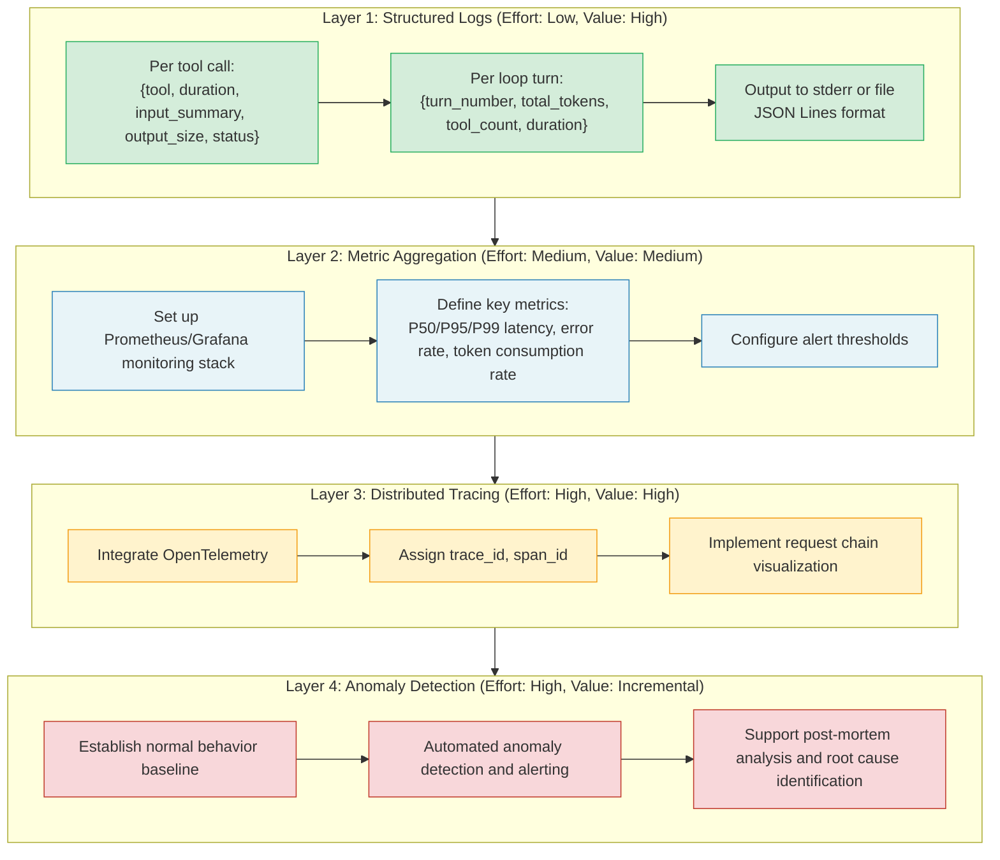

### Multi-Environment Adaptation: CLI / IDE / SDK / Server

Claude Code's dependency injection pattern provides an elegant multi-environment adaptation solution. By abstracting I/O operations into dependency injection interfaces (such as model calls, message compression, UUID generation, etc.), the core loop doesn't need to know what environment it's running in.

In a CLI environment, production dependencies provide real file system access and model calls. In tests, mock implementations can be injected. In SDK mode, different UI feedback mechanisms can be substituted. This "core + adapter" architecture allows the same Harness logic to run seamlessly across different platforms.

Key environment difference points include:

| Environment | Permission Interaction | UI Rendering | Hook Execution | Session Storage |
|-------------|----------------------|--------------|----------------|-----------------|
| CLI | Terminal prompt | Ink/React | Shell commands | Local files |
| IDE (VS Code) | Dialog popup | WebView | Same | Same |
| SDK | Callback functions | None | Same | In-memory |
| Server | Auto-deny/allow | None | HTTP endpoints | Database |

**Multi-environment adaptation architecture pattern:**

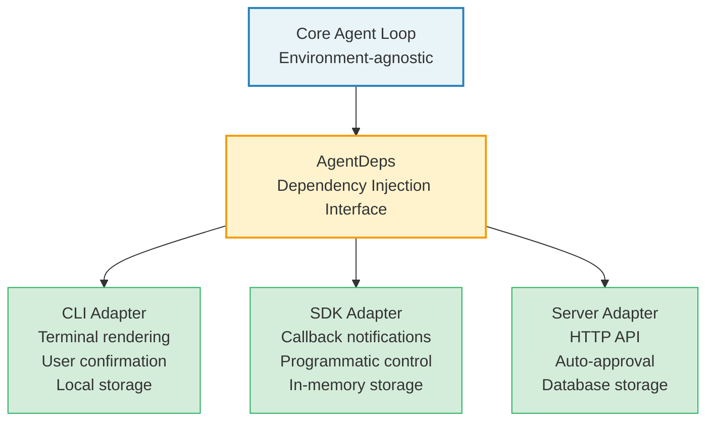

The core principle of this architecture is "the core doesn't know where it's running." If any `if (isCLI) ... else if (isSDK) ...` branch logic appears in the core code, it means dependency injection isn't thorough enough -- environment differences should be encapsulated in adapters, not handled through conditional logic in core code.

### Security Auditing

An Agent Harness's security boundary is more complex than traditional applications because LLM output is unpredictable. Claude Code takes a multi-layered defense approach to security:

1. **Tool permission tiers:** Each tool declares `isReadOnly`, `isDestructive`, and `isConcurrencySafe`; the system determines the approval flow based on these annotations
2. **Workspace trust check:** `shouldSkipHookDueToTrust()` ensures hooks don't execute in untrusted workspaces
3. **Input sanitization:** The `backfillObservableInput` method cleans tool input before passing it to observers, without modifying the API-bound original input (to avoid breaking prompt caching)
4. **Budget ceiling:** The `maxBudgetUsd` parameter limits token costs per query

**Security threat model for Agent systems:**

Agent systems face threats fundamentally different from traditional applications. Traditional application threats come from external attackers (injecting malicious input), while Agent system threats come from the LLM itself -- the model may execute unintended operations due to prompt injection.

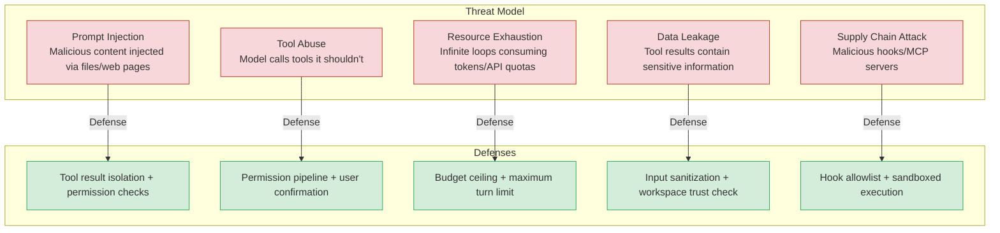

**Security audit checklist:**

- [ ] Every tool has correct `isReadOnly`/`isDestructive`/`isConcurrencySafe` annotations
- [ ] The permission pipeline completes all checks before tool execution (no bypass paths)
- [ ] Budget ceiling is checked on every loop turn, not just at session end
- [ ] Sensitive information in tool results is sanitized before passing to the model
- [ ] Hook commands execute in trusted workspaces; untrusted workspaces are automatically skipped
- [ ] Sub-Agent permissions do not exceed parent Agent's permission scope
- [ ] All permission decisions have audit logs

---

## 15.5 The Future of Agent Harnesses

### Multimodal Interaction

Current tool systems are text-centric, but multimodal interaction is changing this landscape. Claude Code already handles image input (`ImageSizeError`, `ImageResizeError`) and Computer Use tools. Future Agent Harnesses will need:

- **Native multimodal tools:** Tool inputs and outputs are no longer limited to text, but include images, audio, and video
- **Visual understanding tools:** Screenshot analysis, UI element location, chart interpretation
- **Voice interaction:** Voice input triggers tool calls, voice output announces tool results

Multimodal interaction has far-reaching architectural implications for Agent Harnesses. The current `ContentBlock` type system needs extending to support binary data, tool `inputSchema` needs to support file references rather than text-only parameters, and streaming needs to support chunked binary data. These changes aren't simple feature additions, but a refactoring of the core data model.

**New challenges in multimodal scenarios:**

| Challenge | Description | Possible Solutions |
|-----------|-------------|-------------------|
| Large payloads | Images/video can be tens of MB | Chunked transfer + streaming + compression |
| Cost control | Multimodal token prices far exceed text | Adaptive resolution + preprocessing filters |
| Cache efficiency | Image content is hard to prefix-match | Semantic-level caching instead of byte-level |
| Permission model | Screenshots may contain sensitive info | Content moderation + redaction |

### Long-Running Agents (Daemon Mode)

Claude Code's `taskSummaryModule` and background session mechanism foreshadow a new pattern: agents are no longer one-shot command-line tools, but long-running daemon processes. Daemon mode agents feature:

- **Persistent state:** Maintaining context and memory across sessions
- **Event-driven wakeup:** File changes, scheduled tasks, and external notifications trigger actions
- **Multi-agent collaboration:** A primary agent coordinates multiple sub-agents (Claude Code's `AgentTool` already implements this pattern)
- **Resource-aware scheduling:** Intelligently scheduling tasks based on token budget, API quotas, and system load

The implementation challenges of Daemon mode are far more complex than one-shot Agents. First, **state persistence**: conversation history, memory data, and permission configuration all need to persist beyond process lifetimes. Second, **error recovery**: Daemon processes need to recover from crashes, and the recovered state must be consistent. Third, **resource management**: long-running processes mean memory leaks accumulate over time, requiring careful memory management and periodic cleanup.

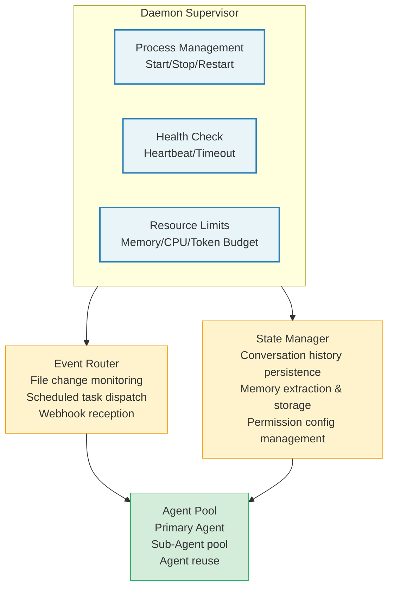

### Standardized Protocols (MCP Evolution)

Model Context Protocol (MCP) is becoming the de facto standard for tool invocation. Claude Code has deeply integrated MCP: tools can come from MCP servers, the `mcp_info` field tracks tool provenance, and `handleElicitation` supports interactive requests from MCP servers.

Future MCP evolution directions include:

- **Standardized tool discovery:** Agents dynamically discover available tools at runtime
- **Cross-agent communication protocol:** Agents from different vendors exchange messages and tool calls through MCP
- **Sandboxed execution:** MCP servers execute tools in isolated environments, providing stronger security guarantees
- **Streaming result delivery:** Tool execution results are streamed back through the MCP protocol, supporting long-running tools

**MCP's impact on Agent Harness design:** MCP standardization means future Agent Harness tool systems will no longer be closed. Tools can come from any MCP-compatible server, and Agents won't need to know all available tools in advance. This poses new challenges for permission systems -- how do you set permission rules for a tool discovered only at runtime? Possible solutions include: automatic permission inference based on tool capability descriptions, trust tiering at the MCP server level, and more granular sandbox isolation.

> **Cross-reference:** The detailed architecture of MCP integration is fully analyzed in Chapter 12, "MCP Integration and External Protocols."

### Forward-Looking Analysis of Future Architectures

Based on deep analysis of Claude Code's architecture and observations of industry trends, we can foresee the following evolution directions for Agent Harnesses:

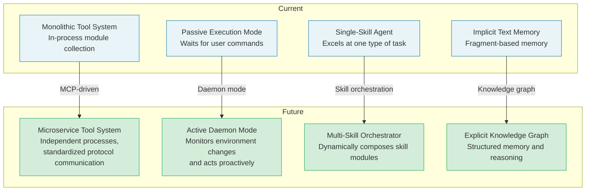

**1. From Monolith to Microservices**

Currently, Claude Code's tool system is an in-process module collection. As MCP matures, future Agent Harnesses may adopt a microservice architecture -- each tool or tool group runs in an independent process, communicating through standardized protocols. This provides better isolation, scalability, and independent deployment capability.

**2. From Passive to Active**

The current Agent execution model is passive -- it waits for user commands before acting. Daemon mode will make Agents active -- they can monitor environment changes and proactively take action. This poses new requirements for prompt design: the Agent needs to determine "does this change require notifying the user" and "can I handle this issue autonomously."

**3. From Single-Skill to Multi-Skill Orchestration**

Currently, an Agent typically excels at one type of task. Future Agent Harnesses may be "skill orchestrators" that dynamically compose different skill modules based on task type. For example, a code change Agent automatically orchestrates code analysis, test generation, code review, and documentation update as four skill modules.

**4. From Implicit Memory to Explicit Knowledge Graphs**

The current memory system is implicit, text-fragment-based memory. Future memory may be structured knowledge graphs -- an Agent doesn't just remember "the user likes Jest," but can also remember "Project A uses Jest, Project B uses Vitest, because..." This structured memory supports more precise retrieval and reasoning.

---

## Hands-on Exercises

Choose one of the following scenarios and design a complete Agent Harness architecture:

**Scenario A: Code Review Agent**
- Tool set: Git operations, file reading, static analysis, comment posting
- Permission model: Read-only mode + comment writing requires confirmation
- Context strategy: Compress by PR dimension, preserving change summaries
- Hooks: Automatically run lint, type checks, inject results into context

**Scenario B: Operations Monitoring Agent**
- Tool set: Log queries, metric retrieval, deployment operations, alert management
- Permission model: Queries auto-approved, operations require dual confirmation
- Context strategy: Sliding window + priority retention for anomalous events
- Hooks: Webhook notifications, audit log recording

**Scenario C: Documentation Generation Agent**
- Tool set: Code analysis, document templates, version comparison, file writing
- Permission model: Automatic mode (trusted write target directory)
- Context strategy: Project-level memory, cross-session style preference persistence
- Hooks: Format checking, link validation

For your chosen scenario, complete the following design:

1. Draw a component relationship diagram (call relationships between dialog loop, tool system, permission pipeline, context management, memory system, and hook system)
2. Define at least three tools with complete `buildTool` definitions
3. Design the four-stage check logic for the permission pipeline
4. Choose a compression strategy and explain trigger conditions
5. Define at least two hooks and their expected behavior

### Extended Exercise: Implementing a Minimal Agent Harness

Based on the six-step roadmap in this chapter, implement a minimal runnable Agent Harness. The suggested implementation order is:

**Week 1: Dialog Loop + Tool System**
- Implement the core `agentLoop` function
- Implement the `buildTool` factory function
- Define 2-3 basic tools (file reading, file listing, command execution)
- Validation: can complete a simple "read file and answer questions" task

**Week 2: Permission Pipeline + Context Management**
- Implement four-stage permission checks
- Implement a simple snip compression strategy
- Add token counting and budget checks
- Validation: can safely execute operations requiring confirmation; long conversations don't overflow

**Week 3: Memory System + Hook System**
- Implement simple memory extraction and injection
- Implement the Shell command hook executor
- Add session_start and post_tool_use hooks
- Validation: memory persists across sessions; hooks correctly intercept and modify behavior

**Week 4: Testing and Productionization**
- Write unit tests for core components
- Add structured logging
- Implement error recovery and circuit breaker
- Use in a real project and collect feedback

---

## Key Takeaways

1. **Loop state pattern:** Using `while(true)` + `State` object + `continue` to manage loop state is easier to debug and maintain than recursive calls. Claude Code's core query function implements this pattern in roughly 1700 lines of code, handling over ten state transition paths. Three reasons loops beat recursion: state recovery is more natural, abort is more controllable, and debugging is more intuitive.

2. **Factory function + fail-closed defaults:** The `buildTool` pattern keeps tool definitions concise; defaults choose the most conservative strategy (unsafe, has side effects, requires confirmation), and tools explicitly override to declare safety. This fail-closed strategy ensures new tools don't produce dangerous behavior before passing security review.

3. **Dependency injection isolates I/O:** The `QueryDeps` pattern abstracts all external dependencies into injectable interfaces, enabling core logic reuse across different environments (CLI, SDK, test). The core principle is "the core doesn't know where it's running" -- environment differences are encapsulated in adapters, not handled through conditional logic in core code.

4. **Progressive compression:** Multi-tier compression strategies (snipping, micro-compression, summary) trigger progressively based on token usage rate, avoiding blanket information loss. When choosing a compression strategy, consider "what information matters most" -- information loss is relative, and the key is preserving what's most valuable for the current task.

5. **Circuit breaker protection:** Consecutive failure counting, maximum recovery attempts, and fallback strategies -- these mechanisms ensure the agent degrades gracefully when facing persistent errors, rather than looping infinitely. Claude Code chose 3 consecutive failures as the threshold based on actual observational data: beyond 3 is usually a systemic issue, making retries pointless.

6. **Feature flag-driven progressive releases:** Compile-time feature flags allow new features to be safely released progressively; disabled code is completely absent from the build output. The three-tier flag strategy (compile-time, runtime config, remote feature flags) each suits different release scenarios.

7. **Security defense in depth:** From tool-level (`isDestructive`) to system-level (workspace trust, budget ceiling), each layer provides independent security guarantees. The security threat model for Agent systems is fundamentally different from traditional applications -- the LLM's output itself is an attack vector, requiring defenses at every layer.

8. **Observability is the cornerstone of productionization:** From structured logs to aggregated metrics to distributed tracing, the four layers of observability provide the foundation for debugging, optimization, and compliance in Agent systems. An Agent system without observability is a black box -- when problems arise, you can only guess.

---

**Book Conclusion**

From understanding the Agent Harness concept in Chapter 1 to building a custom implementation with your own hands in this chapter, we've completed a full journey. Claude Code, as the benchmark for industrial-grade Agent Harnesses, demonstrates what this technology looks like in actual production environments: not a simple API call wrapper, but a complete software architecture integrating conversation management, tool orchestration, permission control, context engineering, memory systems, and observability.

Agent Harness represents a new software paradigm -- not the programmer telling the machine what to do at every step, but the programmer building a framework within which the machine makes autonomous decisions. The quality of this framework determines the upper bound of the agent's capabilities and the lower bound of its safety.

Looking back across the entire book, we see a clear design philosophy: **at every decision point, Claude Code chose the safer, more controllable, more observable option.** Loops over recursion (easier to debug), fail-closed defaults (safer), progressive compression (more controllable), circuit breaker protection (more robust). These choices may individually seem conservative, but together they constitute a system that can be trusted in production environments.

Future software developers need to master two abilities simultaneously: traditional deterministic programming, and this new "meta-programming" -- building Harnesses for AI agents. We hope this book provides a solid starting point for your exploration on this path. Remember, the best Harness doesn't limit the agent's capabilities -- it maximizes the agent's potential while ensuring safety.
