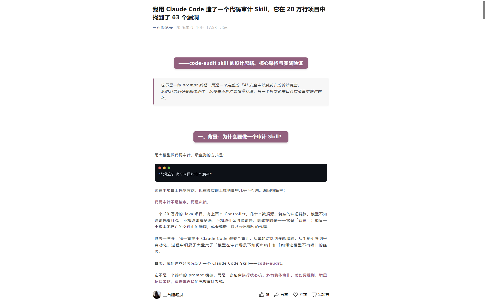

# Code Audit Skill - 深度解读

> 本文基于微信公众号文章《Claude Opus 4.6 白盒代码审计方法论》与《我用 Claude Code 造了一个代码审计 Skill，它在 20 万行项目中找到了 63 个漏洞》深度整理

---

## 文章概述

| 项目 | 上篇 | 下篇 |
|------|------|------|
| **标题** | Claude Opus 4.6 白盒代码审计方法论 | 我用 Claude Code 造了一个代码审计 Skill |
| **核心主题** | 审计决策体系设计方法论 | Skill 完整实现与实战验证 |
| **侧重点** | 哲学、方法论、决策框架 | 架构、防幻觉、多智能体协作 |
| **发布时间** | 2026年2月9日 | 2026年2月10日 |
| **作者** | 三石随笔录 | 三石随笔录 |



---

## 一、核心观点提炼

### 1.1 关键洞察

> **"模型能力已经足够强，但'如何使用模型'才是真正的瓶颈。"**

作者的核心观点：AI 做代码审计，最容易犯的错是**幻觉**，而解决方案不是让 AI 变强，而是**设计一套决策框架**让 AI 不出错。

**核心问题**：
- 项目代码体量大，无法一次性进入上下文
- 单轮审计漏报率高（实际项目中可达 50%+）
- 容易出现"幻觉漏洞"
- 审计深度不可控

### 1.2 六大支柱

```
1. 污点分析驱动   — Source→Propagation→Sink，所有决策围绕数据流
2. 攻击面导向     — 从项目功能推导审计方向，不套模板
3. Agent 并行策略 — 搜索模式互不重叠，完全并行执行
4. 多轮递进       — 广度→深度→关联，每轮目标函数不同
5. 攻击链思维     — 组合低危漏洞构建高危攻击路径
6. 系统性决策     — 三维等级评估、轮次终止规则、优先级排序公式
```

---

## 二、审计哲学：核心分析模型

### 2.1 污点分析模型

```
┌─────────────────────────────────────────────────────────────────┐
│                   所有安全漏洞的本质                              │
│                                                                 │
│   不可信的数据到达了危险的操作                                  │
│                                                                 │
│   Source（源）      用户可控的输入入口                           │
│        ↓                                                        │
│   Propagation（传播） 数据流经的函数、过滤、转换                  │
│        ↓                                                        │
│   Sink（汇）       SQL执行、命令执行、文件读写等危险操作           │
└─────────────────────────────────────────────────────────────────┘
```

### 2.2 优先级排序公式

```
优先级 = (攻击面大小 × 潜在影响) / 利用复杂度
```

| 维度 | 高权重 | 低权重 |
|------|--------|--------|
| 攻击面 | 未认证可达 | 内部接口 |
| 潜在影响 | RCE、全库读取 | 信息收集 |
| 利用复杂度 | 单请求触发 | 需物理接触 |

### 2.3 第一决策原则

> **永远优先审计认证链。**
> 如果认证可被绕过，所有需认证才能触发的漏洞都会被放大为未认证漏洞。
> 一个认证绕过能把 5 个 Medium 升级为 5 个 Critical。

---

## 三、五阶段处理流程

### 3.1 阶段划分与精力分配

| 阶段 | 内容 | 精力 |
|------|------|------|
| Phase 1 | 信息收集与攻击面识别 | 10% |
| Phase 2 | 并行模式匹配扫描 | 30% |
| Phase 3 | 关键路径手工审计 | 40% |
| Phase 4 | 漏洞验证与攻击链构建 | 15% |
| Phase 5 | 报告输出 | 5% |

### 3.2 各阶段详解

#### Phase 1: 画地图，不是找漏洞

**产出四样东西**：
```
1. 技术栈画像 — 语言、框架、数据库、中间件
2. 模块地图   — 哪些模块负责什么功能
3. 攻击面清单 — 所有外部入口和出口
4. 安全机制   — 认证/授权/过滤/加密方案
```

#### Phase 2: 并行扫描，但有章法

Agent 的方向完全由 Phase 1 的攻击面地图推导，核心产出是"高风险区域地图"，发现率在 30-50% 是正常的。

#### Phase 3: 逐行审计，按优先级

**文件优先级排序**：

| 优先级 | 文件类型 | 决策依据 |
|--------|----------|----------|
| P0 | 认证过滤器 / Token 处理 | 认证绕过影响全系统 |
| P0 | 白名单 / 未认证接口 | 直接暴露的攻击面 |
| P0 | 核心业务入口（Sink 最密集的文件） | 漏洞密度最高 |
| P1 | 文件上传下载 / HTTP 出站工具类 | 路径遍历、SSRF 风险 |
| P2 | 配置类、加密工具类 | 配置缺陷、密钥管理 |

#### Phase 4: 验证四步法

| 步骤 | 验证项 | 判定标准 |
|------|--------|----------|
| 1 | 数据流完整性 | Source 到 Sink 中间无截断过滤 |
| 2 | 防护可绕过性 | 安全检查是否有遗漏的边界条件 |
| 3 | 前置条件可满足性 | 攻击者能否到达漏洞触发点 |
| 4 | 影响范围 | 利用后最大损害（RCE？数据泄露？提权？） |

> 四步全过 → 确认漏洞。任一步不过 → 降级或排除。

---

## 四、双轨审计模型

### 4.1 三种审计策略

| 轨道 | 维度 | 方法 | 发现目标 |
|------|-----|------|---------|
| **Sink-driven** | D1（注入）、D4（反序列化）、D5（文件）、D6（SSRF） | Grep 危险函数 → 追踪数据流 → 验证无防护 | **存在的**危险代码 |
| **Control-driven** | D3（授权）、D9（业务逻辑） | 枚举端点 → 验证安全控制是否存在 → 缺失=漏洞 | **缺失的**安全控制 |
| **Config-driven** | D2（认证）、D7（加密）、D8（配置）、D10（供应链） | 搜索配置 → 对比安全基线 | 错误配置 |

### 4.2 核心区别

> **关键区别**: Sink-driven 搜索"存在的危险代码"，Control-driven 搜索"应存在但缺失的安全控制"。
> 授权缺失、IDOR 等漏洞本质上是**代码不存在**（没有权限检查），Grep 搜不到"不存在的代码"。

---

## 五、10 个安全维度

| # | 维度 | 关键问题 |
|---|------|---------|
| D1 | 注入 | 用户输入是否能到达 SQL/Cmd/LDAP/SSTI 执行点？ |
| D2 | 认证 | Token 生成、验证、过期是否完整？ |
| D3 | 授权 | 每个敏感操作是否验证用户归属？ |
| D4 | 反序列化 | 是否存在不受信数据的反序列化？ |
| D5 | 文件操作 | 上传/下载路径是否可控？ |
| D6 | SSRF | 服务端 HTTP 请求的 URL 是否用户可控？ |
| D7 | 加密 | 硬编码密钥？弱算法？ |
| D8 | 配置 | 调试接口暴露？CORS 过宽？ |
| D9 | 业务逻辑 | 竞态条件？流程可跳过？ |
| D10 | 供应链 | 依赖是否有已知 CVE？ |

---

## 六、Agent 并行策略

### 6.1 Agent 决策链

```
项目结构探测
    ↓
识别技术栈特征（语言 + 框架 + 功能模块 + 外部交互）
    ↓
推导攻击面（哪些地方可能有漏洞）
    ↓
按"可并行 + 不重叠"原则切分 Agent 任务
    ↓
执行 → 根据结果识别盲区 → 后续轮次补充
```

### 6.2 切分约束

1. **搜索模式互不重叠** — 每个 Agent 有独占的 Grep 模式集
2. **可完全并行执行** — Agent 之间零依赖，不需要等某个 Agent 完成后才启动另一个

### 6.3 Agent 数量决策

| 因素 | 判断标准 |
|------|----------|
| 攻击面大小 | 功能越多 → Agent 越多 |
| 代码量 | >100K LOC → 5+ Agent 并行加速 |
| 功能交叉度 | 交叉越多 → 切分越细 |
| 发现密度 | 某方向发现集中 → 专设 Agent 深挖 |

**经验值**：小型项目 2-3 个 Agent，中型 3-5 个，大型 5-9 个。

### 6.4 示例：Java Spring Boot 项目

```
Agent 1: SQL 注入
  搜索: ${}, Statement, "SELECT" +, String.format + SQL
  不搜索: JWT, Token, File, URL

Agent 2: 认证与授权
  搜索: JWT, Token, Session, Filter, @PreAuthorize, 白名单
  不搜索: SQL, File, HTTP

Agent 3: 文件操作 + SSRF
  搜索: MultipartFile, FileInputStream, Path, URL, HttpClient
  不搜索: JWT, SQL, ClassLoader

Agent 4: XSS/SSTI/RCE
  搜索: Runtime.exec, ProcessBuilder, ScriptEngine, eval
  不搜索: JWT, SQL, File

Agent 5: 数据源 + 插件
  搜索: JDBC, DriverManager, ClassLoader, Provider
  不搜索: JWT, Template, download
```

---

## 七、多轮审计策略

### 7.1 每轮目标函数不同

| 轮次 | 目标函数 | 方法 | 发现类型 |
|------|---------|------|----------|
| R1 | max(覆盖面) | 模式匹配（Grep） | 表面可见：硬编码、未验证、配置缺陷 |
| R2 | max(深度) | 数据流追踪（逐行审计） | 隐藏在数据流中：拼接链、协议注入、权限缺失 |
| R3 | max(关联度) | 跨模块交叉验证 | 组合才危险：IDOR+白名单、加密体系系统性缺陷 |

### 7.2 为什么多轮能发现更多

1. **一个入口多条路径** — 第一轮定位文件，第二轮展开所有数据流路径
2. **加密需要生命周期追踪** — 密钥的生成→存储→传输→使用全流程需要追踪
3. **跨模块关联需要全局视角** — 白名单 + 下载 + ID 可枚举 = 未认证 IDOR
4. **业务逻辑漏洞无法模式匹配** — Grep 搜不到语义错误的漏洞

### 7.3 轮次终止决策规则

每轮结束后，强制回答三个问题：

```
Q1: 有没有计划搜索但没搜到的区域？
    YES → 需要下一轮（补盲区）

Q2: 发现的入口点是否都追踪到了 Sink？
    NO  → 需要下一轮（追数据流）

Q3: 高风险发现之间是否可能存在跨模块关联？
    YES → 需要下一轮（交叉验证）
```

> 三个问题的答案全部为 NO → 终止。任一为 YES → 继续。

### 7.4 轮次与项目规模

| 项目规模 | 典型轮次 | 典型 Agent 总数 |
|---------|---------|----------------|
| 小型（<10K LOC） | 1 轮 | 2-3 个 |
| 中型（10K-50K） | 1-2 轮 | 3-5 个 |
| 大型（50K-200K） | 2-3 轮 | 5-9 个 |
| 超大型（>200K） | 2-4 轮 | 8-15 个 |

---

## 八、严重等级判定

### 8.1 三维决策模型

```
严重等级 = f(可达性, 影响范围, 利用复杂度)
```

| 维度 | 加重（→高等级） | 中等 | 减轻（→低等级） |
|------|---------------|------|---------------|
| 可达性 | 未认证可达 | 低权限可达 | 管理员权限才可达 |
| 影响范围 | RCE/全库读取 | 部分数据泄露 | 信息收集 |
| 利用复杂度 | 单请求触发 | 需多步骤 | 需特定环境配合 |

### 8.2 编号体系

| 前缀 | CVSS 3.1 | 含义 |
|------|----------|------|
| C | 9.0-10.0 | 可直接导致系统沦陷 |
| H | 7.0-8.9 | 可造成重大损害 |
| M | 4.0-6.9 | 可造成一定损害 |
| L | 0.1-3.9 | 安全加固建议 |

---

## 九、攻击链构建

### 9.1 构建方法

```
对每个 Critical/High 漏洞:
1. 确认前置条件（需要认证？什么权限？什么网络位置？）
2. 如果需要认证 → 检查是否有认证绕过可串联
3. 确认利用结果（信息泄露？代码执行？权限提升？）
4. 检查结果能否作为下一个漏洞的输入
5. 组合为完整攻击链，评估整体影响
```

### 9.2 典型攻击链模式

| 模式 | 链路 | 最终影响 |
|------|------|---------|
| 认证绕过 → 功能滥用 | Token 伪造 → 管理 API → 系统控制 | 全系统沦陷 |
| 认证绕过 → SSRF | JWT 伪造 → SSRF → 云元数据 → 获取凭据 | 云环境接管 |
| 认证绕过 → JDBC | Token 伪造 → 创建 H2 数据源 → RUNSCRIPT | 服务器 RCE |
| 信息泄露 → 认证绕过 | 密钥接口暴露 → 伪造 Token → 全系统访问 | 全系统沦陷 |
| 配置缺陷 → 数据窃取 | CORS * → 恶意页面 → 跨域读取数据 | 用户数据泄露 |

---

## 十、防幻觉机制

### 10.1 三条硬性规则

```
✗ 禁止猜测文件路径——必须用 Glob/Read 验证文件存在
✗ 禁止编造代码片段——必须引用 Read 工具实际输出的代码
✗ 禁止报告未读文件中的漏洞——没有读过的代码不能出现在报告中
```

### 10.2 反确认偏见

```
✗ 禁止 "基于之前的审计经验，我将重点关注..."
✗ 禁止因为某个漏洞类型"看起来不太可能"就跳过检查
✓ 必须枚举所有敏感操作，然后逐一验证
✓ 必须完成完整的检查清单，对每个维度一视同仁
```

### 10.3 核心原则

> **宁可漏报，不可误报。**
> 误报对安全审计的伤害远大于漏报。一份充满误报的报告会让开发团队丧失信任，而漏报可以通过多轮审计逐步弥补。

---

## 十一、增量补漏策略

### 11.1 跨轮传递结构

R1 完成后，主线程产出一个结构化的「跨轮传递结构」：

```
COVERED:  D1(✅ 10个发现), D2(✅ 6个), D3(✅ 14个), D5(✅ 4个), ...
GAPS:     D4(❌ 未覆盖), D9(❌ 未覆盖), D1(⚠️ SQL查询构建层未深入)
CLEAN:    [JNDI/XXE/Fastjson — 已搜索确认不存在的攻击面]
HOTSPOTS: [QueryBuilder.java:135 — 字符替换未追踪, PermissionManager.java — 鉴权逻辑待验证]
FILES_READ: [TokenUtils.java:JWT decode无verify, CryptoUtils.java:硬编码AES密钥, ...]
GREP_DONE: [JWT.decode, @Permission, CREATE ALIAS, loadRemoteFile, ...]
```

### 11.2 R2 Agent 约束

```
• 禁止重读   FILES_READ 中已分析过的文件
• 禁止重复   GREP_DONE 中已执行过的搜索模式
• 直接跳过   CLEAN 中已确认不存在的攻击面
• 优先深入   HOTSPOTS 中 R1 发现但未展开的高风险点
```

### 11.3 R2 Agent 数量自适应

| 缺口状态 | R2 Agent 数量 |
|---------|--------------|
| ❌ 未覆盖 0-1 个 | 1 Agent (20 turns) |
| ❌ 未覆盖 2-3 个 | 2 Agent (2×20 turns) |
| ❌ 未覆盖 4+ 个 | 3 Agent (3×20 turns) |

---

## 十二、Agent 合约

### 12.1 合约模板

```
---Agent Contract---
1. 搜索路径: {paths}。排除: node_modules, .git, build, test, frontend
2. 必须使用 Grep/Glob/Read 工具。禁止 Bash 中 grep/find/cat。
3. 工具调用 ≤50 次，Bash ≤10 次。max_turns: {N}。
4. ★ Turn 预留: turns_used ≥ max_turns-3 时立即停止探索，产出结构化输出。
5. 搜索策略: Grep 定位行号 → Read offset/limit 读上下文（±20行）。
6. 输出: 按结构化模板返回。禁止返回大段原始代码（>3行）。
7. 同类漏洞 ≥5 个合并报告。同 pattern 多文件列清单不逐个深挖。
8. Sink 类别上界: 每维度最多 8 个 Sink 类别，每类最多深追 3 个实例。
9. 数据转换管道追踪: Source → [Transform₁ → ... → Transformₙ] → Sink。
10. ★ 截断防御: HEADER 在最前（≤400字），AGENT_OUTPUT_END 在最后。
---End Contract---
```

### 12.2 关键设计

| 设计 | 问题 | 解决方案 |
|------|------|----------|
| Turn 预留规则 | Agent 在最后一个 turn 还在 Grep 新方向导致输出被截断 | 倒数第 3 个 turn 停止探索，产出结构化结果 |
| 截断防御 | 输出被截断后 HEADER 和发现表格全部丢失 | HEADER 前置 + SENTINEL 哨兵 + 截断检测与恢复 |
| 数据转换管道追踪 | 只看 Controller 和 DAO 会漏掉中间层的注入点 | 对每个 Sink 至少追踪 3 层调用链 |

---

## 十三、实战案例：20万行 Java 项目

### 13.1 项目概况

| 指标 | 数据 |
|------|------|
| 项目 | 某开源 BI 数据可视化平台 |
| 代码量 | ~200K 行 Java |
| 技术栈 | Spring Boot 3.x + Java 21 + MyBatis-Plus + 嵌入式数据库 |
| 模块结构 | core-backend + sdk-common + extensions (多数据源插件) |
| 审计模式 | Standard（2 轮） |

### 13.2 审计执行过程

**Round 1（侦察 + 广度扫描）**

| Agent | 方向 | max_turns | 发现数 |
|-------|------|-----------|--------|
| Agent 1 | SQL/SpEL 注入 (D1) | 25 | 8 |
| Agent 2 | 认证+授权 (D2+D3) | 25 | 16 |
| Agent 3 | 文件+SSRF (D5+D6) | 25 | 6 |
| Agent 4 | 反序列化+RCE (D4+D5) | 25 | 10 |
| Agent 5 | 配置+加密+依赖 (D7+D8+D10) | 25 | 11 |
| **R1 合计** | 125 turns | 51 findings |

> R1 覆盖率评估：8/10（D4 反序列化 ❌、D9 业务逻辑 ❌）

**Round 2（增量补漏 + 深度追踪）**

| Agent | 方向 | max_turns | 新发现 |
|-------|------|-----------|--------|
| R2-Agent 1 | D4+D9（未覆盖维度） | 20 | 4 |
| R2-Agent 2 | 权限注解 AOP + SQL 查询构建层 | 20 | 5 |
| R2-Agent 3 | 跨模块攻击链验证 | 20 | 3 |
| **R2 合计** | 60 turns | 12 findings |

> R2 覆盖率：10/10 ✅

**审计总计**：2 轮 × 8 个 Agent = **63 个漏洞**，165 个 turns。

### 13.3 关键发现

**12 个 Critical 漏洞（部分）**：

| 编号 | 漏洞类型 | CVSS | 核心问题 |
|------|---------|------|----------|
| C-01 | JWT 签名验证完全缺失 | 9.1 | JWT.decode() 无 verify()，可伪造任意用户 |
| C-02 | 权限注解无 AOP 实现 | 9.8 | 社区版鉴权函数永远返回 true |
| C-03 | 嵌入式数据库存储过程 RCE | 9.0 | JDBC URL 注入 → 执行任意 Java 代码 |
| C-04 | SQL 查询构建层 9+ 注入点 | 8.8 | String.format() 拼接表名/字段名 |
| C-05 | JDBC 连接参数反序列化 | 8.6 | 连接参数绕过黑名单触发反序列化 |

### 13.4 Top 3 攻击链

```
Chain 1: JWT Forge → 数据源注入 → RCE (CVSS 9.8, 无需认证)
  伪造管理员 JWT → 添加恶意数据源 → 通过存储过程执行系统命令

Chain 2: JWT Forge → IDOR → 全库数据泄露 (CVSS 9.1, 无需认证)
  伪造任意用户 JWT → 枚举资源 ID → 导出所有业务数据

Chain 3: SSRF → Cloud Metadata → IAM 凭证窃取 (CVSS 8.6)
  通过外部数据导入 URL → 请求云元数据服务 → 获取云平台凭证
```

### 13.5 R2 的关键贡献

R2 以不到 R1 一半的 Token 成本，发现了 4 个 R1 完全遗漏的 Critical 漏洞：

1. **权限注解无 AOP 实现** — R1 看到了自定义权限注解被广泛使用，但没有追踪其实现
2. **SQL 查询构建层注入** — R1 扫描了 MyBatis 模式，但该项目使用 String.format() 拼接
3. **HashMap 并发竞态** — R1 没有覆盖 D9 业务逻辑维度
4. **Mass Assignment** — R2 追踪用户资料编辑 API，发现可直接修改 roleId 等敏感字段

---

## 十四、四种扫描模式

| 模式 | 适用场景 | 轮次 | Agent 数 | 特点 |
|------|---------|------|----------|------|
| Quick | CI/CD 集成、小项目 | 1 轮 | 2-3 | 高风险漏洞 + 密钥泄露 + 依赖 CVE |
| Quick-Diff | PR 审查、增量提交 | 1 轮 | 1-2 | 只审计 git diff 变更的文件 |
| Standard | 常规安全审计 | 1-2 轮 | 3-9 | OWASP Top 10 完整覆盖 |
| Deep | 关键系统、渗透测试前 | 2-4 轮 | 5-15 | 全量覆盖 + 攻击链 + 业务逻辑 |

---

## 十五、与传统 SAST 工具对比

| 维度 | 传统 SAST (Semgrep/SonarQube) | code-audit Skill |
|------|------------------------------|------------------|
| 检测方式 | 固定规则模式匹配 | LLM 语义理解 + 数据流追踪 |
| 数据流追踪 | 有限（通常 1-2 跳） | 深度（3+ 跳，含中间转换层） |
| 业务逻辑漏洞 | 几乎无法检测 | 可检测（D9 维度） |
| 误报率 | 较高（20-40%） | 较低（防幻觉规则约束） |
| 攻击链分析 | 无 | 支持多漏洞串联分析 |
| 上下文理解 | 无（逐文件扫描） | 有（跨文件、跨模块推理） |
| 可解释性 | 规则 ID + 代码位置 | 完整数据流 + 利用路径 + PoC |
| 运行成本 | 低（本地执行） | 较高（LLM API 调用） |
| 新漏洞模式 | 需手动添加规则 | 可基于代码上下文推理发现 |

---

## 十六、踩过的坑与解决方案

| 坑 | 问题 | 解决方案 |
|-----|------|----------|
| Agent 输出被截断 | 发现全部丢失 | Turn 预留规则 + HEADER 前置 + SENTINEL 哨兵 |
| R2 重复 R1 的工作 | ~65% Token 浪费 | 跨轮传递结构（COVERED/GAPS/CLEAN/HOTSPOTS） |
| 幻觉漏洞 | 报告不存在的文件中的漏洞 | 三条防幻觉硬规则 + 代码证据要求 |
| 确认偏见 | 某维度发现多就集中投入 | 覆盖率矩阵强制自检 + Sink 类别上界 |
| Skill 文档冗余矛盾 | 同一规则两处定义 | 单一权威来源 + 防坑编写指南 |

---

## 十七、总结

code-audit Skill 的核心创新：

```
1. 防幻觉优先   — 宁可漏报不可误报，每个发现必须有代码证据
2. 覆盖率驱动   — 10 维度矩阵确保不遗漏任何安全方向
3. 增量补漏     — R2 只补缺口不重复，Token 效率提升 40%+
4. Agent 合约   — 结构化约束让多智能体行为可控可预测
5. 截断防御     — HEADER 前置 + 哨兵机制确保关键数据不丢失
6. 攻击链思维   — 不只找单点漏洞，还分析多漏洞组合的端到端攻击路径
```

> **"工具在进化，但安全审计的本质没有变：系统性地发现所有可能的攻击路径，并证明它们是否可被利用。"**

---

## 参考资料

- [Code Audit Skill 详解（上）- 微信公众号](https://mp.weixin.qq.com/s/K5yJ9nPUzwpBV5rMPPKfCg)
- [Code Audit Skill 详解（下）- 微信公众号](https://mp.weixin.qq.com/s/yTPehTfk1ufv3RXq6gh1mA)
- [Code Audit Skill GitHub](https://github.com/wj-wyt/code-audit-agents)

---

*本文档整理自 2026年2月9日-10日微信公众号「三石随笔录」发布的两篇深度文章*